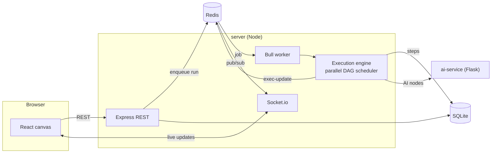

# FlowForge

[](https://github.com/connor-p-mccune/FlowForge/actions/workflows/ci.yml)

**Visual workflow automation builder with real-time collaboration.**

FlowForge lets you build automations on a drag-and-drop canvas: drop nodes
(triggers, HTTP requests, conditions, AI steps, outputs…), connect them to
define the order they run in, and execute. The backend parses the canvas into a
directed acyclic graph (DAG), topologically sorts it, and runs each node in
order while streaming live progress back to every collaborator on the canvas.

---

## Screenshots

> _Placeholders — drop real images into `docs/screenshots/` and update these._

| Canvas & collaboration | Execution run |
|------------------------|---------------|
|  |  |

---

## Features

- **Drag-and-drop canvas** — build workflows visually with React Flow, with
  one-click **auto-layout** ("Tidy") that arranges the graph into clean layers
  and **undo/redo** (`Ctrl/⌘-Z`) that broadcasts each step to collaborators so
  everyone converges on the same state.
- **Rich node library** — manual, webhook & schedule triggers; HTTP request,
  delay, email, Slack, and transform actions; branching conditions and a
  **switch** node that routes a run down the first of many labelled cases to
  match (an `if` vs a `switch`); **filter**, **map**, and **aggregate** nodes
  that trim a list to matching items, reshape each one, or roll it up to totals;
  AI prompt / classify / extract nodes; log outputs; **sub-workflows** (call a
  workflow as a step) and **for-each** (fan a workflow out over a list).
- **Safe expression language (FXL)** — write real logic where a dropdown
  comparison runs out: a condition's **matches expression** operator and the
  filter node's predicate both take expressions like
  `amount > 1000 && status in ["pending", "review"]`, with a curated function
  library (`len`, `upper`, `contains`, `round`, …). It's a hand-written
  lexer → Pratt parser → tree-walking evaluator with **no `eval`/`Function`/`vm`
  anywhere** — a string is inert data, calls reach only the vetted stdlib, and
  member access is prototype-safe and step-bounded. The linter parses every
  expression up front, so a syntax error or a typo'd function name is caught
  before the run, and every expression field has an **inline playground** to
  evaluate it against sample data. See [docs/EXPRESSIONS.md](./docs/EXPRESSIONS.md).
- **Human-in-the-loop approvals** — drop an **Approval** gate anywhere in a
  workflow: the run pauses, every workspace member is notified, and whoever
  decides first routes the run down the approved or rejected branch — from the
  dashboard's **Waiting on you** inbox, the run panel, a notification link,
  the public API (dedicated `approve` token scope), or `flowforge approve` in
  a terminal. Timeouts are configurable (reject the branch or fail the run),
  and test runs auto-approve.
- **Execution engine** — parses the graph into a DAG and schedules it with a
  ready-set scheduler: independent branches run **in parallel** (bounded by
  `EXEC_MAX_PARALLEL`), joins wait for every upstream branch, `{{node-id.field}}`
  templates resolve between steps, failures retry with backoff, and every step
  is recorded.
- **Concurrency limits** — cap how many runs of a workflow execute at once
  (singleton deploys, non-overlapping syncs) and choose the at-limit behavior:
  **queue** parks the run until a slot frees, **reject** refuses it with a
  `409` at every entry point — and skips schedule ticks, so a cron workflow
  never overlaps itself.
- **Resume from failure** — continue a failed (or cancelled) run from where it
  stopped: steps that already succeeded are **reused** rather than re-executed
  — an approval gate that was already granted is not asked twice — and only
  the failed remainder runs again. Available from run history, the public API,
  and `flowforge resume --watch` in CI.
- **Encrypted secrets** — store API keys once per workspace (AES-256-GCM at
  rest), reference them as `{{secrets.NAME}}`, and they're masked in run logs.
  Values are write-only: rotate or delete, never read back.
- **Public REST API** — trigger workflows and poll runs from CI or scripts via
  `/api/v1`, authenticated with scoped, expiring personal access tokens
  (hash-only storage), with **Idempotency-Key** support so retried triggers
  never double-run. See [docs/API.md](./docs/API.md).
- **CLI** — `flowforge trigger <id> --watch` runs a workflow and exits non-zero
  unless it completed, turning any workflow into a one-line CI gate. Zero
  dependencies; see [cli/README.md](./cli/README.md).
- **Node test bench** — run a single node in isolation from its config panel
  with a sample input, without executing the whole graph: dry-run by default
  (side-effecting nodes report what they'd send), or fire for real. Reuses the
  engine's own runner + secret-redaction pipeline, so a bench run behaves
  exactly like the node would inside a run.
- **Workflow linter** — one click checks the canvas before you run it: cycles,
  dead branches, missing config, references to nodes that aren't upstream,
  unknown `{{secrets.*}}` names, undeployed sub-workflow targets. Click an
  issue to jump to the offending node.
- **Version diffs** — every deploy snapshots the graph; the history drawer can
  preview any version, restore it (reversibly), or **diff it against the live
  canvas** — nodes added/removed, changed config fields, and rewired
  connections.
- **Status badges** — mint a per-workflow badge token and embed a live SVG of
  its latest run status (passing / failing / running) in a README or dashboard,
  just like a CI badge — hand-rendered, cached, and revocable by rotating the
  token.
- **Command palette** — `Ctrl/⌘-K` fuzzy-jumps to any workflow, page, or action
  across every workspace.
- **Live execution streaming** — step-by-step status updates pushed to the UI
  over WebSockets as a run progresses, with a **Stop** button for cooperative
  cancellation.
- **Run timeline & critical path** — any finished run renders as a Gantt chart:
  per-step bars inside the run's wall-time window make parallel branches and
  slow steps obvious at a glance, and the **critical path** — the longest
  dependency chain that actually set the run's duration, found with the classic
  critical path method — is highlighted, so what's worth optimising is one look
  away.
- **Run insights & SLA monitoring** — every workflow gets a **📊 Insights**
  panel: duration percentiles (p50–p99), success rate, throughput, the slowest
  steps, and a sparkline of recent runs with **anomalous runs flagged** by a
  robust **modified z-score** (median + MAD, so a heavy tail of slow runs can't
  mask itself), plus a **degradation trend** — a Mann-Kendall test that catches a
  workflow getting slower over time, a creep no single run trips. Declare
  optional **SLA targets** — a max run duration and a min
  success rate — and a finished run that breaches one (too slow, statistically
  abnormal, or a success rate that dips below the floor) notifies the owner and
  streams an `execution.sla_breached` event to the activity feed and any
  outbound webhook. The success-rate check is edge-triggered, so a sustained
  outage alerts once, not on every run. Available in the panel, via
  `flowforge insights`, and on the public API. See
  [docs/INSIGHTS.md](./docs/INSIGHTS.md).
- **Predictive run forecast** — *before* running a workflow, estimate how long
  it will take and which step is the bottleneck. It reuses the critical-path
  method — the same longest-path-over-a-DAG that analyses a finished run — run
  **forward** over the current graph, weighting each node by its historical step
  time (p50/p95). It reports a typical and worst-case makespan and a **coverage**
  ratio, so an estimate over a barely-run graph is marked as the guess it is.
  In the insights panel, `flowforge forecast <id>`, and the public API.
- **Schedule preview** — a schedule trigger fires on a cron expression, but a
  cron string is opaque: "does `0 9 * * 1-5` skip weekends? when does it next
  run?". A dependency-free **cron engine** answers both — it parses the
  expression (5/6-field, ranges, steps, lists, named months/days, `@macros`) and
  **computes the actual upcoming fire times**, correctly handling the Vixie
  day-of-month/day-of-week OR-rule and sparse dates like Feb 29. The schedule
  node shows the next runs live as you type; `flowforge schedule <id>` and the
  public API expose the same.
- **Real-time collaboration** — multiple people edit the same workflow at once
  with shared cursors, presence, and last-write-wins sync.
- **Webhook triggers** — generate a public URL that fires a workflow on POST;
  the request body flows into the graph as the trigger's output. Optionally
  **HMAC-signed**: deliveries must carry a timestamped SHA-256 signature over
  the raw body (constant-time verified, replay-window bounded).
- **Outbound webhooks** — push workspace events (`execution.failed`,
  `workflow.*`, …) to your own systems: durable SQLite-backed delivery queue,
  exponential-backoff retries, HMAC-signed payloads, a per-endpoint delivery
  log with one-click redelivery, and a test ping. See
  [docs/API.md](./docs/API.md#receiving-events-outbound-webhooks).
- **AI suggestions** — ask the assistant for sensible next nodes based on the
  current graph.
- **Workspaces & auth** — JWT auth, per-user workspaces, and workflow CRUD.
- **Observability** — a zero-dependency Prometheus exporter at `/metrics`
  (request rates/latency by route, run outcomes and durations, queue depth,
  process stats) plus a deep readiness probe at `/api/health/ready` that
  verifies SQLite and Redis before reporting healthy. Every request carries a
  **correlation id** (inbound `X-Request-Id` honored, echoed on the response,
  included in 500 bodies) and logs one **structured JSON line** — a
  user-reported failure maps to its log lines with one grep.
- **Graceful shutdown** — on SIGTERM the process drains instead of dying
  mid-run: new work stops, in-flight runs settle, the readiness probe flips
  to `503 draining` so the orchestrator routes around it, and a hard deadline
  backstops anything that hangs.
- **Polish** — input validation, loading skeletons, empty states, toast
  notifications, an error boundary, and a responsive, collapsible sidebar.

---

## Architecture

Four containers on a shared Docker network:

| Service      | Port (host) | Tech                     | Purpose                                   |
|--------------|-------------|--------------------------|-------------------------------------------|
| `client`     | 5173        | React + Vite, nginx      | Canvas UI, collaboration, auth            |
| `server`     | 3001        | Node.js + Express        | REST API, Socket.io, Bull worker          |
| `ai-service` | (internal)  | Python + Flask, gunicorn | LLM node suggestions & AI node execution  |
| `redis`      | (internal)  | Redis 7                  | Bull job queue + Socket.io pub/sub        |

- **SQLite** is the database (`better-sqlite3`), persisted in the `db-data`
  Docker volume at `/app/data/flowforge.db`.
- `redis` and `ai-service` are **internal-only** — only the `server` talks to
  them over the compose network; they are not published to the host.
- The browser talks to `client` (static assets) and `server` (REST + WebSocket)
  directly; it never calls the AI service.

**Data flow for a run:** UI `POST /api/workflows/:id/execute` → server enqueues
a Bull job → the worker runs the execution engine → each step publishes an
`exec-update` over Redis pub/sub → the Socket.io layer relays it to everyone in
the workflow's room → the UI updates live.



Operational surface: liveness at `GET /api/health`, deep readiness (SQLite +
Redis exercised) at `GET /api/health/ready`, and Prometheus metrics at
`GET /metrics`.

For the design decisions behind all of this — the parallel scheduler, the
redaction pipeline, the collaboration model, the linter, the metrics design —
see **[docs/ARCHITECTURE.md](./docs/ARCHITECTURE.md)**.

---

## Prerequisites

- [Docker](https://docs.docker.com/get-docker/) and Docker Compose
- An OpenAI API key (for the AI features)

---

## Quick start

```bash
# 1. Clone
git clone <your-fork-url> flowforge && cd flowforge

# 2. Create your .env from the template and fill in values
cp .env.example .env
#   - set JWT_SECRET to any long random string
#   - set OPENAI_API_KEY to your key (sk-...)

# 3. Build and start everything
docker-compose up --build

# 4. Open the app
#    http://localhost:5173
```

That's it — a fresh clone with a populated `.env` is all you need. The database
is created and migrated automatically on first boot.

To stop: `docker-compose down`. To also wipe the database: `docker-compose down -v`.

---

## Environment variables

Copy `.env.example` to `.env` before running. **Never commit `.env`.**

| Variable          | Required | Description                                            |
|-------------------|----------|--------------------------------------------------------|
| `JWT_SECRET`      | yes      | Secret used to sign JWTs (any long random string)      |
| `OPENAI_API_KEY`  | yes\*    | OpenAI key for AI suggestions & AI nodes               |
| `VITE_API_URL`    | yes      | Browser-facing server URL (baked into the client build)|
| `AI_SERVICE_URL`  | no       | Server → AI service URL (defaults to the compose host) |
| `SECRETS_ENCRYPTION_KEY` | no | Dedicated key material for workspace-secret encryption (falls back to `JWT_SECRET`) |
| `EXEC_MAX_PARALLEL` | no     | Max concurrently-executing nodes per run (default 4; 1 = sequential) |
| `CONCURRENCY_RETRY_MS` | no  | How long a run parked at its workflow's concurrency cap waits before re-checking (default 1000) |
| `METRICS_TOKEN`   | no       | Bearer token guarding `GET /metrics` (unguarded when unset) |
| `LOG_LEVEL`       | no       | `debug` \| `info` (default) \| `warn` \| `error` \| `silent` |
| `LOG_FORMAT`      | no       | `pretty` for human-readable dev logs (default: one JSON line per event) |
| `SHUTDOWN_TIMEOUT_MS` | no   | Hard deadline for the graceful-shutdown drain (default 30000) |
| `NODE_TEST_TIMEOUT_MS` | no  | Per-node timeout for the single-node test bench (default 30000) |
| `WEBHOOK_MAX_ATTEMPTS` | no  | Delivery attempts per outbound webhook event (default 5) |
| `WEBHOOK_DISPATCH_INTERVAL_MS` | no | Outbound webhook delivery-queue poll interval (default 5000) |
| `EXECUTION_RETENTION_DAYS` | no | Prune terminal runs older than this many days (default: keep forever) |
| `SLA_SUCCESS_RATE_WINDOW` | no | Runs in the rolling success-rate window for SLA monitoring (default 20) |
| `SLA_SUCCESS_RATE_MIN_RUNS` | no | Minimum settled runs before the success-rate floor check fires (default 5) |
| `SLA_ANOMALY_MIN_RUNS` | no | Minimum completed-run baseline before an anomaly alert fires (default 20) |
| `WEBHOOK_DELIVERY_RETENTION_DAYS` | no | Prune settled delivery-log rows after this many days (default 30; 0 = keep) |

\* The app runs without it, but any AI node or the Suggest button will error
until a valid key is set.

**Optional — real email delivery** for the Send Email node. Without `SMTP_HOST`,
email sends are simulated (logged, not delivered):

```
SMTP_HOST=        SMTP_PORT=587      SMTP_SECURE=false
SMTP_USER=        SMTP_PASS=         EMAIL_FROM=flowforge@example.com
```

> **Manual-setup nodes:** the **Slack** node takes an incoming-webhook URL you
> create in Slack, and the **Send Email** node needs the SMTP vars above for
> real delivery. Both are configured per use — no global setup required to try
> the app.

---

## Using FlowForge

1. **Register** an account — a personal workspace is created automatically.
2. **Create a workflow** with the `+` button in the sidebar.
3. **Add nodes** from the canvas toolbar and drag between handles to connect them.
4. **Configure** a node by selecting it and editing the side panel. Reference an
   upstream node's output anywhere with `{{node-id.field}}` — the panel's
   **Insert data from upstream** section lists what's available and copies
   references for you.
5. **Check** the workflow with 🔎 Issues — the linter flags anything that would
   fail before you run it; click a finding to jump to the node. Use a node's
   **Test this node** section to bench it in isolation with a sample input
   before wiring up the whole graph.
6. **Run** with the ▶ button and watch steps stream into the execution panel;
   **Stop** cancels a run cooperatively. In run history, flip to the
   **Timeline** view to see a Gantt chart of where the time went.
   If the run hits an **Approval** gate it pauses right there — approve or
   reject inline from the panel (or from the notification every member gets).
7. **Webhooks:** open the Webhooks panel to mint a public trigger URL.
8. **Collaborate:** share the workflow URL — edits, cursors, and runs sync live,
   and `Ctrl/⌘-Z` undo/redo keeps everyone converged.
9. **Secrets:** store API keys under the workspace's Secrets page and reference
   them anywhere as `{{secrets.NAME}}` — they stay encrypted and out of run logs.
10. **Automate externally:** mint an API token in Settings and trigger runs from
    scripts via `POST /api/v1/workflows/:id/trigger` ([docs](./docs/API.md),
    [OpenAPI](./docs/API.md#machine-readable-spec)).
11. **Navigate fast:** press `Ctrl/⌘-K` for the command palette, ▦ Tidy to
    auto-arrange a messy canvas, `Ctrl/⌘-D` to duplicate a node, and the
    minimap to move around large graphs.
12. **Ship safely:** 🚀 Deploy snapshots a version; the History drawer previews,
    **diffs against the live canvas**, and restores any of them.

---

## Local development (without Docker)

The Docker setup serves production builds. For hot-reload development, run the
services directly (Node 20+ and Python 3.11+):

```bash
# Redis (needed by the server) — easiest via Docker:
docker run -p 6379:6379 redis:7-alpine

# AI service
cd ai-service && pip install -r requirements.txt && python app.py

# Server (new terminal)
cd server && npm install && npm run dev

# Client (new terminal)
cd client && npm install && npm run dev
```

Make sure `.env` values are exported or present; the server reads them via
`dotenv`.

---

## Testing & linting

```bash
# Server — ESLint + Jest
cd server && npm run lint && npm test

# Client — ESLint + Vitest
cd client && npm run lint && npm test

# AI service — Ruff + pytest
cd ai-service && ruff check . && python -m pytest

# CLI — node:test (zero dependencies, no install step)
cd cli && npm test
```

CI (`.github/workflows/ci.yml`) runs lint **and** tests for all four packages
on every push and pull request to `main`.

---

## Deployment

Production deploys to **Railway** (server, ai-service, Redis) and **Vercel**
(client). See **[DEPLOYMENT.md](./DEPLOYMENT.md)** for the full step-by-step guide,
and **[.env.production.example](./.env.production.example)** for the required
environment variables per service.

---

## Common commands

```bash
docker-compose up --build            # build + start everything
docker-compose up --build server     # rebuild + start one service
docker-compose logs -f server        # tail one service's logs
docker-compose exec server sh        # shell into a running container
docker-compose down                  # stop everything
docker-compose down -v               # stop and wipe the database volume
```

---

## Project structure

```
flowforge/
├── client/        React + Vite frontend (served by nginx in prod)
├── server/        Express API, Socket.io, Bull worker, SQLite
├── ai-service/    Flask microservice for LLM-backed features
├── cli/           Zero-dependency terminal client for the public API
├── docs/          API reference, architecture deep dive, FXL reference
├── docker-compose.yml
├── .env.example
├── .env.production.example
├── DEPLOYMENT.md
└── .github/workflows/ci.yml
```
