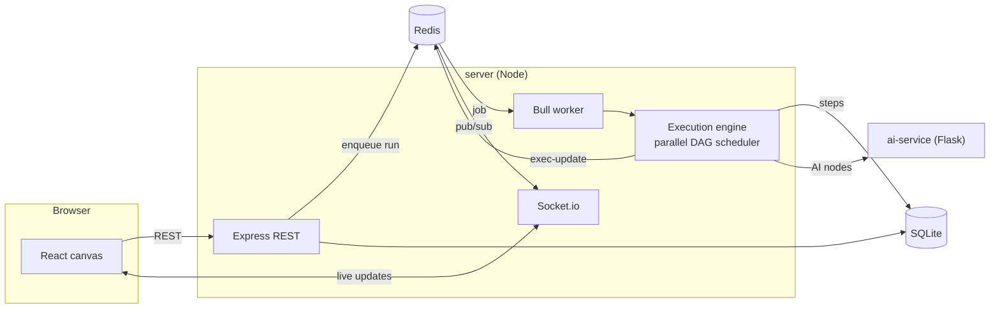

# FlowForge

[](https://github.com/connor-p-mccune/FlowForge/actions/workflows/ci.yml)

**Visual workflow automation builder with real-time collaboration.**

FlowForge lets you build automations on a drag-and-drop canvas: drop nodes
(triggers, HTTP requests, conditions, AI steps, outputs…), connect them to
define the order they run in, and execute. The backend parses the canvas into a
directed acyclic graph (DAG), topologically sorts it, and runs each node in
order while streaming live progress back to every collaborator on the canvas.

---

## Screenshots

> _Placeholders — drop real images into `docs/screenshots/` and update these._

| Canvas & collaboration | Execution run |
|------------------------|---------------|
|  |  |

---

## Features

- **Drag-and-drop canvas** — build workflows visually with React Flow, with
  one-click **auto-layout** ("Tidy") that arranges the graph into clean layers,
  **undo/redo** (`Ctrl/⌘-Z`) that broadcasts each step to collaborators so
  everyone converges on the same state, and **sticky notes** (📝, four colors)
  for annotating the graph — they have no connections, never execute, and the
  linter ignores them.
- **Rich node library** — manual, webhook & schedule triggers; HTTP request,
  delay, email, Slack, and transform actions; branching conditions, a **switch**
  node that routes a run down the first of many labelled cases to match (an `if`
  vs a `switch`), and a **validate** node that checks a payload against a JSON
  Schema and forks valid/invalid; **filter**, **map**, and **aggregate** nodes
  that trim a list to matching items, reshape each one, or roll it up to totals;
  AI prompt / classify / extract nodes; log outputs; **sub-workflows** (call a
  workflow as a step) and **for-each** (fan a workflow out over a list).
- **Safe expression language (FXL)** — write real logic where a dropdown
  comparison runs out: a condition's **matches expression** operator and the
  filter node's predicate both take expressions like
  `amount > 1000 && status in ["pending", "review"]`, with a curated function
  library (`len`, `upper`, `contains`, `round`, …). It's a hand-written
  lexer → Pratt parser → tree-walking evaluator with **no `eval`/`Function`/`vm`
  anywhere** — a string is inert data, calls reach only the vetted stdlib, and
  member access is prototype-safe and step-bounded. The linter parses every
  expression up front, so a syntax error or a typo'd function name is caught
  before the run, and every expression field has an **inline playground** to
  evaluate it against sample data. See [docs/EXPRESSIONS.md](./docs/EXPRESSIONS.md).
- **Human-in-the-loop approvals** — drop an **Approval** gate anywhere in a
  workflow: the run pauses, every workspace member is notified, and whoever
  decides first routes the run down the approved or rejected branch — from the
  dashboard's **Waiting on you** inbox, the run panel, a notification link,
  the public API (dedicated `approve` token scope), or `flowforge approve` in
  a terminal. Timeouts are configurable (reject the branch or fail the run),
  and test runs auto-approve.
- **Machine-in-the-loop callbacks** — a **Wait for Callback** node pauses the
  run until an external system POSTs to its one-time URL, then routes down
  the received or timed-out branch with the delivered payload: async job
  APIs and payment confirmations become a single node. The URL is minted
  **before anything executes** and referenced upstream as
  `{{callbacks.node-id}}`, so a reply that arrives before the run even
  reaches the wait node is stored, not lost; delivery is first-wins, and the
  token dies with the run.
- **Execution engine** — parses the graph into a DAG and schedules it with a
  ready-set scheduler: independent branches run **in parallel** (bounded by
  `EXEC_MAX_PARALLEL`), joins wait for every upstream branch, `{{node-id.field}}`
  templates resolve between steps, failures retry with backoff, and every step
  is recorded.
- **Run priority lanes** — every run enters the queue as **high**, **normal**,
  or **low**: a workflow sets its default lane in Run limits, any API trigger
  overrides it per run (`?priority=high`, `flowforge trigger --priority`),
  and the lane is recorded on the run for history. Priority orders pickup —
  it never preempts executing runs, and stays FIFO within a lane. Dry runs
  always ride the high lane (someone is watching), replays and resumes keep
  their original's lane, and a run deferred at a concurrency cap re-parks
  without being demoted.
- **Concurrency limits** — cap how many runs of a workflow execute at once
  (singleton deploys, non-overlapping syncs) and choose the at-limit behavior:
  **queue** parks the run until a slot frees, **reject** refuses it with a
  `409` at every entry point — and skips schedule ticks, so a cron workflow
  never overlaps itself.
- **Rate limiting** — cap how many runs a workflow may **start** within a
  rolling window (e.g. 100 per hour), independent of the concurrency cap:
  concurrency bounds how many run *at once*, the rate limit bounds how *often*
  they start — so a runaway schedule or a webhook sender firing in bursts can't
  hammer a downstream API even when each run finishes instantly. Enforced at the
  same admission gate as the concurrency cap, so every entry point is covered by
  one check; the window slides by run-start time, dry runs are exempt, and
  refusals surface as a `409` and land on `/metrics`
  (`flowforge_runs_rate_limited_total`).
- **Pause (operational kill switch)** — hold a workflow with one click when
  something downstream is on fire: while paused, **no new real run starts at
  any entry point** — the Run button, the public API, webhook deliveries,
  schedule ticks, and error-handler escalations are all held. Two boundaries
  are deliberate: **in-flight runs settle normally** (stopping mid-run is what
  cancellation is for) and **dry runs stay allowed**, because whoever paused it
  is usually the person debugging it. Idempotent from the toolbar, the public
  API (`manage` scope), or `flowforge pause <id>`; wrap a deploy window so no
  cron tick fires into a half-migrated system, and the silent skips land on
  `/metrics`.
- **Scheduled maintenance windows** — the kill switch on a timer: declare a
  recurring window (a cron **start** plus a **duration**) and FlowForge
  auto-pauses the workflow while it's open and resumes it when it closes — a
  nightly migration, a downstream API's own maintenance hour, a weekly deploy
  freeze. It reuses the same cron engine as schedule previews (UTC), and never
  fights an operator: a **manual pause survives** a window ending, and a
  workflow a person already paused is never auto-touched. Clearing the window
  releases any pause it was holding, so a config change can't strand a workflow
  paused.
- **Schedule backfill** — replay re-runs a *recorded* run; backfill runs the
  ones that never happened: a schedule deployed late, a workflow paused through
  an incident, logic fixed after three weeks of wrong output. Pick a window and
  FlowForge recreates every occurrence its cron **would** have fired — same
  engine, same time zone, so a backfill across a daylight-saving change matches
  the real schedule instead of a naive UTC grid. Each run carries the instant it
  *represents* as `{{trigger.logicalDate}}`, so a workflow that processes
  "yesterday" processes the right yesterday rather than recomputing today 20
  times. Guardrails throughout: every surface **previews the run count before
  anything is created** (and the canvas clears the plan the moment you edit the
  window), an over-cap range is refused rather than silently truncated,
  occurrences that already ran are skipped so re-submitting an overlapping range
  is safe, and the batch rides the **low lane** so it can't starve live traffic.
  Pause blocks it — bulk historical traffic is what pausing is *for* — while the
  rate limit deliberately doesn't, since that bounds unattended frequency and a
  backfill is an explicit, bounded, human decision. Watch progress per batch and
  stop one midway; from the canvas, `flowforge backfill <id> --from 7d --yes`,
  or the public API.
- **Resume from failure** — continue a failed (or cancelled) run from where it
  stopped: steps that already succeeded are **reused** rather than re-executed
  — an approval gate that was already granted is not asked twice — and only
  the failed remainder runs again. Available from run history, the public API,
  and `flowforge resume --watch` in CI.
- **Step-level result caching** — a node that opts in memoises its output
  under a **content-addressed key** (SHA-256 of its type + resolved config +
  input): a later run doing byte-for-byte the same work adopts the recorded
  output — step status **cached** — instead of re-fetching or re-paying for
  an AI call. Invalidation is the addressing: any change to config, upstream
  data, or a rotated secret is a different key, so nothing goes stale
  silently; a TTL bounds how long repeats may coast, only clean successes
  are stored (redacted, like everything persisted), dry runs bypass the
  cache both ways, and hit/miss/store counts land on `/metrics`. The linter
  flags cache config that can't take effect (and the POST that wouldn't
  post).
- **Per-node error handling** — decide per node what its failure means. The
  default still fails the run, but a node can **continue** (its
  `{ failed, error }` object flows downstream as ordinary data) or take a
  dedicated red **error branch** — the same handle mechanism condition
  branches use — so a flaky API gets a retry-then-fallback path instead of a
  3am page. Retries still run first; the step records a distinct **caught**
  status so the timeline never hides that the failure happened, and the
  linter flags a wired error branch whose policy can never route to it.
- **Error-handler workflows** — escalation is also just a workflow: designate
  another workflow to run whenever a real run of this one **fails**, receiving
  the failure (workflow, run id, failed node, error message) as its trigger
  data — so "on failure, file a ticket / page someone / roll back" is built on
  the same canvas with the same nodes. A one-line loop guard (handler runs
  never fire handlers) caps any chain at depth one.
- **Encrypted secrets** — store API keys once per workspace (AES-256-GCM at
  rest), reference them as `{{secrets.NAME}}`, and they're masked in run logs.
  Values are write-only: rotate or delete, never read back.
- **Workspace variables** — the plain-config counterpart to secrets: store
  environment base URLs, channel names, and thresholds once per workspace and
  reference them as `{{vars.NAME}}` in any node config. Values are **readable
  and diffable** (that's the point — config you can see), so changing one
  re-points every workflow that references it; the linter flags a `{{vars.*}}`
  name that doesn't exist, and anything sensitive belongs in secrets instead,
  which variables deliberately don't replace.
- **Public REST API** — trigger workflows and poll runs from CI or scripts via
  `/api/v1`, authenticated with scoped, expiring personal access tokens
  (hash-only storage), with **Idempotency-Key** support so retried triggers
  never double-run. See [docs/API.md](./docs/API.md).
- **CLI** — `flowforge trigger <id> --watch` runs a workflow and exits non-zero
  unless it completed, turning any workflow into a one-line CI gate. Zero
  dependencies; see [cli/README.md](./cli/README.md).
- **Node test bench** — run a single node in isolation from its config panel
  with a sample input, without executing the whole graph: dry-run by default
  (side-effecting nodes report what they'd send), or fire for real. Reuses the
  engine's own runner + secret-redaction pipeline, so a bench run behaves
  exactly like the node would inside a run.
- **Workflow test scenarios** — turn a workflow into a regression-testable unit.
  A scenario is a named trigger payload plus a list of **FXL assertions** over
  the run's output (`output.total > 0`, `steps["http-1"].status == 200`,
  `status == "completed"`); running it drives the workflow in dry-run mode
  (nothing fires, approvals auto-approve) and reports exactly which assertion
  failed. Author and run them in the canvas's **🧪 Tests** panel, and gate CI on
  the whole suite with `flowforge test <id>` (exits non-zero on any failure;
  `--junit <file>` writes a report GitHub/GitLab/Jenkins render natively) or
  the public `POST /api/v1/workflows/:id/tests/run` endpoint — the same testing
  discipline the codebase applies to itself, pointed at the workflows you build.
- **Static types over the canvas** — a visual builder usually finds out its
  data doesn't line up by running. FlowForge knows the shape of what flows
  between nodes and checks against it first: every runner's output is a
  contract (`{ status: number, body: any }`), those shapes propagate across the
  DAG, and a `{{http-1.bdy}}` becomes a lint error with a **spelling
  suggestion** instead of an empty string nobody notices. Expressions get the
  same treatment against the scope the graph proves they'll have — so
  `amount * customer` (arithmetic on an object), `sum(status)`, and
  `dateAdd(t, 1, "weeks")` are caught statically, as is `items.length`, which is
  a number in a `{{…}}` template and silently `undefined` in an expression
  because the two read paths have genuinely different member semantics. It's a
  real type lattice — unions, per-field optionality, structural join — and it
  mirrors the engine rather than approximating it: a branch's contribution to a
  join is optional because the branch may not fire, a node whose `onError` is
  `continue` types as the union of its output and the engine's error object, and
  a Transform node's template is read as the schema it literally is. The whole
  thing is built on **not guessing**: `any` (dynamic by contract) and `unknown`
  (nothing to say) are different facts and both silence every check, so a graph
  full of webhook payloads reports nothing at all. The config panel's data
  picker is generated from it, `flowforge types <id>` prints it, and
  `GET /api/v1/workflows/:id/types` serves it. See
  [docs/TYPES.md](./docs/TYPES.md).
- **Workflow linter** — one click checks the canvas before you run it: cycles,
  dead branches, missing config, references to nodes that aren't upstream,
  unknown `{{secrets.*}}` / `{{vars.*}}` names, undeployed sub-workflow
  targets. Click an issue to jump to the offending node — or run the same
  linter from CI: `flowforge lint <id>` gates on the live graph, and
  `flowforge lint <id> file.json` vets an exported definition against its
  target workspace **before** importing it.
- **Cross-workflow impact analysis** — workflows reference each other through
  sub-workflow calls, for-each fan-outs, and error-handler designations, which
  together form a dependency graph across a workspace. Before you undeploy or
  delete something, **see what breaks**: the run settings panel, `flowforge deps
  <id>`, and `GET /api/v1/workflows/:id/dependencies` all show what a workflow
  calls, what calls it (each edge labelled with the relationship kind), and
  whether it sits on a **stale cross-workflow cycle** (A→B→A) — the kind that
  fails at run time with a circular-reference error, surfaced statically before
  it does.
- **Version diffs** — every deploy snapshots the graph; the history drawer can
  preview any version, restore it (reversibly), or **diff it against the live
  canvas** — nodes added/removed, changed config fields, and rewired
  connections.
- **Workflows as code** — export any workflow as a **portable JSON document**
  (no internal ids or ownership) and import it into any workspace — both in
  the app and from the terminal, where `flowforge export <id> > sync.json`
  and `flowforge import <ws-id> sync.json` close the GitOps loop: definitions
  live in git, get diffs and code review, and CI **promotes them between
  environments** under a dedicated `manage` token scope (imports land as
  drafts — deploying stays a deliberate act). And because a loop can silently
  come apart, **drift detection** closes the check: `flowforge diff <id>
  sync.json` (or `POST /api/v1/workflows/:id/diff`) compares the live
  workflow against the file and exits non-zero when they differ — the
  promotion someone forgot, or the hand-edit someone made in production —
  with node moves ignored, so only meaningful changes count.
- **Status badges** — mint a per-workflow badge token and embed a live SVG of
  its latest run status (passing / failing / running) in a README or dashboard,
  just like a CI badge — hand-rendered, cached, and revocable by rotating the
  token.
- **Public status pages** — statuspage.io for your workflows: a workspace
  owner publishes a shareable, read-only page at `/status/<token>` showing
  every deployed workflow's recent runs as **uptime bars** with success
  rate, typical duration, and last-run age. Deliberately unactionable — no
  ids, no error text, no drafts, no dry runs — so it's safe for an on-call
  channel or a client; rotate the link and every shared copy dies.
- **Run cost accounting & budgets** — concurrency bounds how many runs go at
  once, the rate limit bounds how often they start, pause stops everything —
  and none of them bounds **money**. An AI node inside a for-each over a list
  that grew, on a schedule nobody watches, sits inside all three limits and
  still runs up a bill. So every run is metered: AI steps are priced from the
  **token usage the provider reports**, totalled onto the run, and rolled up per
  workflow, per node type, and per day. Set a **monthly budget** and FlowForge
  warns at a threshold (once a month, not once a run) and then refuses new runs
  at the same admission gate every other limit uses — while in-flight runs
  finish and dry runs keep working, so whoever is diagnosing the overspend isn't
  the one locked out. Failed runs count, because a run that died after its AI
  call still spent the money. The accounting is deliberately honest about its
  limits: only what can actually be known is priced, so a third-party API call
  is **counted but not priced** unless you tell FlowForge your rate, and an
  unpriced model shows as a visible gap rather than a confident zero. Stored as
  integer micro-USD, so summing the same rows two ways always agrees.
- **Tamper-evident audit log** — the activity feed tells your team what
  happened; this tells an auditor what changed and proves the record wasn't
  edited. Every governed action (secrets, variables, membership, API tokens,
  deploys, deletes, imports, manual pause/resume, status-page publication) is
  appended to a **per-workspace hash chain**: each entry's SHA-256 covers its own
  fields *plus the previous entry's hash*, so editing any entry invalidates every
  entry after it, and a contiguous sequence number makes a deletion visible as a
  hole even if the hashes were recomputed. Append-only is enforced by **database
  triggers**, not convention — so tampering needs schema-level access, and the
  chain still catches it. One click verifies the whole chain and reports the
  first divergence (edited / deleted / reordered are three distinct findings);
  `flowforge audit --verify` does the same from a cron and exits non-zero, so
  the integrity check is something that actually runs. Export the trail as CSV or
  JSON **with the chain fields**, so a recipient can re-verify it without
  trusting the server. The limit is documented rather than oversold: a chain
  proves internal consistency, not notarisation — anchoring the returned head
  hash externally is what would catch a wholesale rewrite.
- **Command palette** — `Ctrl/⌘-K` fuzzy-jumps to any workflow, page, or action
  across every workspace.
- **Full-text search** — "which workflow calls the Stripe API?" is a query,
  not an archaeology project: an **SQLite FTS5** index over names,
  descriptions, and graph contents (node labels, config strings, sticky
  notes) powers deep results in the command palette, `GET /api/v1/search`,
  and `flowforge search`. The index maintains itself **lazily at read time**
  (no write-path hooks to forget), ranks name matches above config mentions,
  and every hit shows a snippet of why it surfaced.
- **Live execution streaming** — step-by-step status updates pushed to the UI
  over WebSockets as a run progresses, with a **Stop** button for cooperative
  cancellation.
- **Run timeline & critical path** — any finished run renders as a Gantt chart:
  per-step bars inside the run's wall-time window make parallel branches and
  slow steps obvious at a glance, and the **critical path** — the longest
  dependency chain that actually set the run's duration, found with the classic
  critical path method — is highlighted, so what's worth optimising is one look
  away.
- **Run comparison** — "it worked Tuesday and fails today" is a diff
  question, so run history answers it with a diff: pick two runs and see
  them lined up node by node — status changes, per-step duration deltas
  (with the **slowest regression** called out), and output differences
  computed structurally so key order can't cry wolf. In the history panel
  (⇄ Compare), `flowforge compare`, and the public API.
- **Run insights & SLA monitoring** — every workflow gets a **📊 Insights**
  panel: duration percentiles (p50–p99), success rate, throughput, the slowest
  steps, and a sparkline of recent runs with **anomalous runs flagged** by a
  robust **modified z-score** (median + MAD, so a heavy tail of slow runs can't
  mask itself), plus a **degradation trend** — a Mann-Kendall test that catches a
  workflow getting slower over time, a creep no single run trips. Declare
  optional **SLA targets** — a max run duration and a min
  success rate — and a finished run that breaches one (too slow, statistically
  abnormal, or a success rate that dips below the floor) notifies the owner and
  streams an `execution.sla_breached` event to the activity feed and any
  outbound webhook. The success-rate check is edge-triggered, so a sustained
  outage alerts once, not on every run. Available in the panel, via
  `flowforge insights`, and on the public API. See
  [docs/INSIGHTS.md](./docs/INSIGHTS.md).
- **SLO error budgets & burn-rate alerts** — a 99% objective *allows* 1% of
  runs to fail; that allowance is the whole reason for choosing 99% over 100%.
  So instead of paging on every dip, declare an objective and FlowForge tracks
  the **error budget**: how many failures the window permits, how many are
  spent, and — the number that matters — **how fast**
  (`burn rate = observed failure rate ÷ allowed failure rate`; a burn rate of 1
  exhausts the budget exactly at the end of the window). Alerting is
  **multi-window** in the Google SRE Workbook style, and that's the point: a
  short window alone is jumpy (ten failures in five minutes is usually a deploy
  that recovered), a long window alone is slow (a severe outage takes hours to
  move a 28-day average), so a tier fires only when **both** agree — 14.4× over
  1h pages, 6× over 6h files a ticket. Reported as runs, not just percentages
  ("10 failures left" is actionable), with a projected exhaustion time computed
  from the *sustained* rate rather than the jumpiest one. A target of 1 is
  refused (no budget means every burn rate divides by zero), too few runs
  reports "unknown" rather than "healthy", and cancelled runs count as neither
  good nor bad — stopping a run is an intervention, not a service failure.
- **Heartbeat monitoring** — a dead-man's switch per workflow: declare "a
  real run of me completes successfully every N minutes" in Run limits, and
  FlowForge alerts when the workflow **goes quiet** — the failure mode SLA
  checks can't see, because there's no run to check: a schedule silently
  unregistered, a webhook sender decommissioned, an upstream cron box dead.
  Alerts are edge-triggered (a weekend-long outage is one
  `workflow.heartbeat_missed` event, fanned out through the activity feed,
  outbound webhooks, and an owner notification — not one per minute), the
  first success after an alert emits `workflow.heartbeat_recovered` so every
  open gets a close, and a never-run workflow measures its silence from the
  moment it was deployed. Dry runs don't count as heartbeats; misses land on
  `/metrics`.
- **Predictive run forecast** — *before* running a workflow, estimate how long
  it will take and which step is the bottleneck. It reuses the critical-path
  method — the same longest-path-over-a-DAG that analyses a finished run — run
  **forward** over the current graph, weighting each node by its historical step
  time (p50/p95). It reports a typical and worst-case makespan and a **coverage**
  ratio, so an estimate over a barely-run graph is marked as the guess it is.
  In the insights panel, `flowforge forecast <id>`, and the public API.
- **Schedule preview** — a schedule trigger fires on a cron expression, but a
  cron string is opaque: "does `0 9 * * 1-5` skip weekends? when does it next
  run?". A dependency-free **cron engine** answers both — it parses the
  expression (5/6-field, ranges, steps, lists, named months/days, `@macros`) and
  **computes the actual upcoming fire times**, correctly handling the Vixie
  day-of-month/day-of-week OR-rule and sparse dates like Feb 29. The schedule
  node shows the next runs live as you type; `flowforge schedule <id>` and the
  public API expose the same.
- **Time-zone-aware schedules** — "weekdays at 9am" means 9am in an office, so a
  schedule (and a maintenance window) can name an **IANA time zone** and hold
  its local hour across daylight-saving changes instead of drifting an hour
  twice a year. Zone arithmetic is dependency-free, reading offsets from the
  runtime's own tz data via `Intl` — so rule changes arrive with the platform,
  not with a package bump. The two days a year it's hard are handled
  explicitly: a wall clock **skipped** by spring-forward (02:30 on a
  02:00→03:00 day) fires at the transition instant, so a daily job still runs
  once rather than silently vanishing for a day; a wall clock **repeated** by
  fall-back (01:30 twice) fires once, on the first occurrence. Previews show
  each run as local time + the offset in effect *and* the UTC instant, and flag
  a DST change falling inside the window — because a correct schedule whose UTC
  column jumps an hour otherwise reads as a bug.
- **Real-time collaboration** — multiple people edit the same workflow at once
  with shared cursors, presence, and last-write-wins sync.
- **Webhook triggers** — generate a public URL that fires a workflow on POST;
  the request body flows into the graph as the trigger's output. Optionally
  **HMAC-signed**: deliveries must carry a timestamped SHA-256 signature over
  the raw body (constant-time verified, replay-window bounded). And optionally
  **gated**: an FXL predicate over the delivery body (`event == "push" &&
  ref == "main"`) decides at the door whether a delivery fires — non-matching
  deliveries are acknowledged (so senders don't retry) but start no run,
  validated at save time like every other expression, and editable without
  rotating the URL senders hold.
- **Outbound webhooks** — push workspace events (`execution.failed`,
  `workflow.*`, …) to your own systems: durable SQLite-backed delivery queue,
  exponential-backoff retries, HMAC-signed payloads, a per-endpoint delivery
  log with one-click redelivery, and a test ping. See
  [docs/API.md](./docs/API.md#receiving-events-outbound-webhooks).
- **AI suggestions** — ask the assistant for sensible next nodes based on the
  current graph.
- **Workspaces & auth** — JWT auth, per-user workspaces, and workflow CRUD,
  with **three membership roles**: owners manage the workspace (members,
  secrets, variables, deletion), members build and run workflows, and
  **viewers observe** — they see everything, including live runs, and can
  comment, but every state-changing operation is refused across the app, the
  public API (a token acts as its owner, so a viewer's token is read-only
  regardless of scopes), and the real-time collaboration layer (a viewer's
  graph edits are dropped at the socket). Invite with
  `role: "viewer"`; promote later — ownership is only ever granted
  explicitly, never by invitation.
- **Observability** — a zero-dependency Prometheus exporter at `/metrics`
  (request rates/latency by route, run outcomes and durations, queue depth,
  process stats) plus a deep readiness probe at `/api/health/ready` that
  verifies SQLite and Redis before reporting healthy. Every request carries a
  **correlation id** (inbound `X-Request-Id` honored, echoed on the response,
  included in 500 bodies) and logs one **structured JSON line** — a
  user-reported failure maps to its log lines with one grep.
- **Distributed tracing (W3C + OTLP)** — the timeline shows where time went
  *inside* a run and goes blind the moment a step calls out. Now a run is a
  participant in the wider trace instead of an opaque box beside it: a webhook
  delivery carrying `traceparent` makes the run a **child span of the request
  that triggered it**, every HTTP node injects the trace context for **its own
  step** so the service it calls hangs off that exact node, and
  `GET /executions/:id/trace` emits **OTLP/JSON** — the format an OpenTelemetry
  collector already accepts, so pushing a run into Jaeger or Tempo is a curl,
  not a translation layer. Built without an OTel SDK, because what's actually
  needed is a 55-character header with a strict grammar and a JSON shape with a
  published schema. Parsing is deliberately strict (a malformed header attaches
  runs to the *wrong* parent, which is worse than starting a fresh trace), a
  hand-set `traceparent` is never overwritten, and a `caught` step is exported
  as an error span because the node really did fail. Run cost rides the root
  span, so a spend spike and a latency spike are one query.
- **Outbound circuit breaker** — a host that keeps failing stops being
  called: after N consecutive failures (connection errors or 5xx) its
  circuit **opens** and calls fast-fail with a clear error instead of
  stacking timeouts across node retries and webhook attempts; after a
  cooldown a single **half-open probe** decides whether to close it. One
  breaker wraps the shared egress path, so HTTP nodes, Slack nodes, and
  outbound webhook deliveries are all covered — per host, so one dead API
  can't fast-fail a healthy one. Trips and open circuits are visible on
  `/metrics`.
- **Graceful shutdown** — on SIGTERM the process drains instead of dying
  mid-run: new work stops, in-flight runs settle, the readiness probe flips
  to `503 draining` so the orchestrator routes around it, and a hard deadline
  backstops anything that hangs.
- **Polish** — input validation, loading skeletons, empty states, toast
  notifications, an error boundary, and a responsive, collapsible sidebar.

---

## Architecture

Four containers on a shared Docker network:

| Service      | Port (host) | Tech                     | Purpose                                   |
|--------------|-------------|--------------------------|-------------------------------------------|
| `client`     | 5173        | React + Vite, nginx      | Canvas UI, collaboration, auth            |
| `server`     | 3001        | Node.js + Express        | REST API, Socket.io, Bull worker          |
| `ai-service` | (internal)  | Python + Flask, gunicorn | LLM node suggestions & AI node execution  |
| `redis`      | (internal)  | Redis 7                  | Bull job queue + Socket.io pub/sub        |

- **SQLite** is the database (`better-sqlite3`), persisted in the `db-data`
  Docker volume at `/app/data/flowforge.db`.
- `redis` and `ai-service` are **internal-only** — only the `server` talks to
  them over the compose network; they are not published to the host.
- The browser talks to `client` (static assets) and `server` (REST + WebSocket)
  directly; it never calls the AI service.

**Data flow for a run:** UI `POST /api/workflows/:id/execute` → server enqueues
a Bull job → the worker runs the execution engine → each step publishes an
`exec-update` over Redis pub/sub → the Socket.io layer relays it to everyone in
the workflow's room → the UI updates live.


```mermaid
flowchart LR
    subgraph Browser
        UI[React canvas]
    end
    subgraph server["server (Node)"]
        API[Express REST]
        WS[Socket.io]
        Worker[Bull worker]
        Engine[Execution engine<br/>parallel DAG scheduler]
    end
    AI["ai-service (Flask)"]
    R[(Redis)]
    DB[(SQLite)]

    UI -- REST --> API
    UI <-- live updates --> WS
    API -- enqueue run --> R
    R -- job --> Worker
    Worker --> Engine
    Engine -- steps --> DB
    Engine -- exec-update --> R
    R -- pub/sub --> WS
    Engine -- AI nodes --> AI
    API --> DB
```

Operational surface: liveness at `GET /api/health`, deep readiness (SQLite +
Redis exercised) at `GET /api/health/ready`, and Prometheus metrics at
`GET /metrics`.

For the design decisions behind all of this — the parallel scheduler, the
redaction pipeline, the collaboration model, the linter, the metrics design —
see **[docs/ARCHITECTURE.md](./docs/ARCHITECTURE.md)**.

---

## Prerequisites

- [Docker](https://docs.docker.com/get-docker/) and Docker Compose
- An OpenAI API key (for the AI features)

---

## Quick start

```bash
# 1. Clone
git clone <your-fork-url> flowforge && cd flowforge

# 2. Create your .env from the template and fill in values
cp .env.example .env
#   - set JWT_SECRET to any long random string
#   - set OPENAI_API_KEY to your key (sk-...)

# 3. Build and start everything
docker-compose up --build

# 4. Open the app
#    http://localhost:5173
```

That's it — a fresh clone with a populated `.env` is all you need. The database
is created and migrated automatically on first boot.

To stop: `docker-compose down`. To also wipe the database: `docker-compose down -v`.

---

## Environment variables

Copy `.env.example` to `.env` before running. **Never commit `.env`.**

| Variable          | Required | Description                                            |
|-------------------|----------|--------------------------------------------------------|
| `JWT_SECRET`      | yes      | Secret used to sign JWTs (any long random string)      |
| `OPENAI_API_KEY`  | yes\*    | OpenAI key for AI suggestions & AI nodes               |
| `VITE_API_URL`    | yes      | Browser-facing server URL (baked into the client build)|
| `AI_SERVICE_URL`  | no       | Server → AI service URL (defaults to the compose host) |
| `SECRETS_ENCRYPTION_KEY` | no | Dedicated key material for workspace-secret encryption (falls back to `JWT_SECRET`) |
| `EXEC_MAX_PARALLEL` | no     | Max concurrently-executing nodes per run (default 4; 1 = sequential) |
| `CONCURRENCY_RETRY_MS` | no  | How long a run parked at its workflow's concurrency cap waits before re-checking (default 1000) |
| `COST_MODEL_PRICES` | no     | JSON override of the AI price table, e.g. `{"gpt-4o-mini":{"input":150000,"output":600000}}` (micro-USD per 1M tokens) |
| `OTEL_SERVICE_NAME` | no     | `service.name` on exported OTLP spans (default `flowforge`) |
| `METRICS_TOKEN`   | no       | Bearer token guarding `GET /metrics` (unguarded when unset) |
| `LOG_LEVEL`       | no       | `debug` \| `info` (default) \| `warn` \| `error` \| `silent` |
| `LOG_FORMAT`      | no       | `pretty` for human-readable dev logs (default: one JSON line per event) |
| `SHUTDOWN_TIMEOUT_MS` | no   | Hard deadline for the graceful-shutdown drain (default 30000) |
| `NODE_TEST_TIMEOUT_MS` | no  | Per-node timeout for the single-node test bench (default 30000) |
| `STEP_CACHE_MAX_BYTES` | no  | Largest step output the result cache will store (default 262144) |
| `WEBHOOK_MAX_ATTEMPTS` | no  | Delivery attempts per outbound webhook event (default 5) |
| `CIRCUIT_BREAKER_THRESHOLD` | no | Consecutive failures to one host before its outbound circuit opens (default 5) |
| `CIRCUIT_BREAKER_COOLDOWN_MS` | no | How long an open circuit fast-fails before probing the host again (default 30000) |
| `WEBHOOK_DISPATCH_INTERVAL_MS` | no | Outbound webhook delivery-queue poll interval (default 5000) |
| `EXECUTION_RETENTION_DAYS` | no | Prune terminal runs older than this many days (default: keep forever) |
| `SLA_SUCCESS_RATE_WINDOW` | no | Runs in the rolling success-rate window for SLA monitoring (default 20) |
| `SLA_SUCCESS_RATE_MIN_RUNS` | no | Minimum settled runs before the success-rate floor check fires (default 5) |
| `SLA_ANOMALY_MIN_RUNS` | no | Minimum completed-run baseline before an anomaly alert fires (default 20) |
| `HEARTBEAT_CHECK_INTERVAL_MS` | no | How often the heartbeat monitor sweeps for overdue workflows (default 60000) |
| `MAINTENANCE_CHECK_INTERVAL_MS` | no | How often the maintenance-window sweep reconciles auto-pause/resume (default 60000) |
| `WEBHOOK_DELIVERY_RETENTION_DAYS` | no | Prune settled delivery-log rows after this many days (default 30; 0 = keep) |

\* The app runs without it, but any AI node or the Suggest button will error
until a valid key is set.

**Optional — real email delivery** for the Send Email node. Without `SMTP_HOST`,
email sends are simulated (logged, not delivered):

```
SMTP_HOST=        SMTP_PORT=587      SMTP_SECURE=false
SMTP_USER=        SMTP_PASS=         EMAIL_FROM=flowforge@example.com
```

> **Manual-setup nodes:** the **Slack** node takes an incoming-webhook URL you
> create in Slack, and the **Send Email** node needs the SMTP vars above for
> real delivery. Both are configured per use — no global setup required to try
> the app.

---

## Using FlowForge

1. **Register** an account — a personal workspace is created automatically.
2. **Create a workflow** with the `+` button in the sidebar.
3. **Add nodes** from the canvas toolbar and drag between handles to connect them.
4. **Configure** a node by selecting it and editing the side panel. Reference an
   upstream node's output anywhere with `{{node-id.field}}` — the panel's
   **Insert data from upstream** section lists what's available and copies
   references for you.
5. **Check** the workflow with 🔎 Issues — the linter flags anything that would
   fail before you run it; click a finding to jump to the node. Use a node's
   **Test this node** section to bench it in isolation with a sample input
   before wiring up the whole graph.
6. **Run** with the ▶ button and watch steps stream into the execution panel;
   **Stop** cancels a run cooperatively. In run history, flip to the
   **Timeline** view to see a Gantt chart of where the time went.
   If the run hits an **Approval** gate it pauses right there — approve or
   reject inline from the panel (or from the notification every member gets).
7. **Webhooks:** open the Webhooks panel to mint a public trigger URL.
8. **Collaborate:** share the workflow URL — edits, cursors, and runs sync live,
   and `Ctrl/⌘-Z` undo/redo keeps everyone converged.
9. **Secrets & variables:** store API keys under the workspace's Secrets page
   (`{{secrets.NAME}}` — encrypted, masked in run logs) and plain config like
   base URLs under Variables (`{{vars.NAME}}` — readable, diffable, visible in
   logs). One edit re-points every workflow that references the name.
10. **Automate externally:** mint an API token in Settings and trigger runs from
    scripts via `POST /api/v1/workflows/:id/trigger` ([docs](./docs/API.md),
    [OpenAPI](./docs/API.md#machine-readable-spec)).
11. **Navigate fast:** press `Ctrl/⌘-K` for the command palette, ▦ Tidy to
    auto-arrange a messy canvas, `Ctrl/⌘-D` to duplicate a node, and the
    minimap to move around large graphs.
12. **Ship safely:** 🚀 Deploy snapshots a version; the History drawer previews,
    **diffs against the live canvas**, and restores any of them.

---

## Local development (without Docker)

The Docker setup serves production builds. For hot-reload development, run the
services directly (Node 20+ and Python 3.11+):

```bash
# Redis (needed by the server) — easiest via Docker:
docker run -p 6379:6379 redis:7-alpine

# AI service
cd ai-service && pip install -r requirements.txt && python app.py

# Server (new terminal)
cd server && npm install && npm run dev

# Client (new terminal)
cd client && npm install && npm run dev
```

Make sure `.env` values are exported or present; the server reads them via
`dotenv`.

---

## Testing & linting

```bash
# Server — ESLint + Jest
cd server && npm run lint && npm test

# Client — ESLint + Vitest
cd client && npm run lint && npm test

# AI service — Ruff + pytest
cd ai-service && ruff check . && python -m pytest

# CLI — node:test (zero dependencies, no install step)
cd cli && npm test
```

CI (`.github/workflows/ci.yml`) runs lint **and** tests for all four packages
on every push and pull request to `main`.

---

## Deployment

Production deploys to **Railway** (server, ai-service, Redis) and **Vercel**
(client). See **[DEPLOYMENT.md](./DEPLOYMENT.md)** for the full step-by-step guide,
and **[.env.production.example](./.env.production.example)** for the required
environment variables per service.

---

## Common commands

```bash
docker-compose up --build            # build + start everything
docker-compose up --build server     # rebuild + start one service
docker-compose logs -f server        # tail one service's logs
docker-compose exec server sh        # shell into a running container
docker-compose down                  # stop everything
docker-compose down -v               # stop and wipe the database volume
```

---

## Project structure

```
flowforge/
├── client/        React + Vite frontend (served by nginx in prod)
├── server/        Express API, Socket.io, Bull worker, SQLite
├── ai-service/    Flask microservice for LLM-backed features
├── cli/           Zero-dependency terminal client for the public API
├── docs/          API reference, architecture deep dive, FXL + type references
├── docker-compose.yml
├── .env.example
├── .env.production.example
├── DEPLOYMENT.md
└── .github/workflows/ci.yml
```
