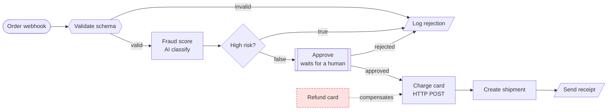
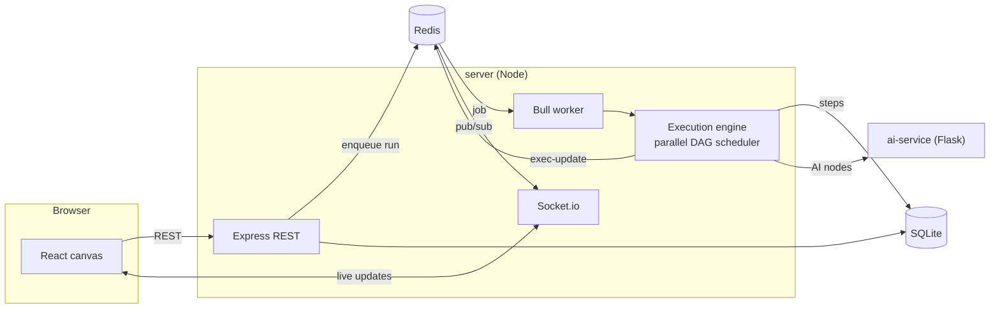

# FlowForge

[](https://github.com/connor-p-mccune/FlowForge/actions/workflows/ci.yml)

**Visual workflow automation builder with real-time collaboration.**

FlowForge lets you build automations on a drag-and-drop canvas: drop nodes
(triggers, HTTP requests, conditions, AI steps, outputs…), connect them to
define the order they run in, and execute. The backend parses the canvas into a
directed acyclic graph (DAG), topologically sorts it, and runs each node in
order while streaming live progress back to every collaborator on the canvas.

---

## If you only read one section

The feature list below is long. These are the parts that were hard, each with a
short design record explaining the decision behind it — start wherever the
problem sounds familiar.

| | The problem | Where |
|---|---|---|
| **Path invariants** | Every static check asks about a *place* — this node's config, this value's shape. None could answer *"can this ever charge a card without the approval having run?"*, which is about a **path**. Turns out the engine's activation rule makes that question identical to graph dominance, so it's a solved compiler problem. Violations report the counterexample path. | [GUARANTEES.md](./docs/GUARANTEES.md) |
| **Reaching a branch** | Every check here reasons about the *graph*, so a switch case sitting under a condition that already ruled it out is wired, typed, reachable and dead — and nothing says so. Asking whether an input exists is a solver question: difference logic, finite domains, DPLL(T). The solver returns a *model*, so the answer is also the payload that drives the branch — which is how the test suite gets generated. | [PATHS.md](./docs/PATHS.md) |
| **Collaborative editing** | Last-write-wins on `Date.now()` meant whose laptop was fast decided whose edit survived, edits collided per *element* so two people editing different fields of one node lost half the work, and a dropped connection diverged **permanently**. Now a CRDT — commutative and idempotent, tested by applying every permutation of an operation set and asserting one document. | [ARCHITECTURE.md](./docs/ARCHITECTURE.md#real-time-collaboration) |
| **Reviewing a definition** | The GitOps loop — drift detection, three-way merge, Ed25519 signing — is all built around a document a human reviews, and the document is JSON. Renaming a node is a diff nobody reads, the connections live in a flat array at the bottom of the file, and `exportedAt` means `git diff` on an *unchanged* workflow is never empty. A line-oriented text format fixes all three, and its emit order is the signature's canonical order, so re-formatting can't break a signature. | [DSL.md](./docs/DSL.md) |
| **Approving a run** | "The run pauses until *a* member responds" is the right default and the wrong one for what people put gates in front of: a refund, a migration, a payout. The requirement is the right humans, enough of them, and not the person who asked. Quorum, owner-only, separation of duties — plus the parts that are easy to get wrong: one rejection settles it, one person counts once (a `UNIQUE` index, not a check), and the linter refuses a gate the workspace can never satisfy, because an unsatisfiable gate doesn't fail — it *waits*. | [APPROVALS.md](./docs/APPROVALS.md) |
| **Watching the data** | Every monitor here watches *time* (percentiles, trend, change point) or *outcome* (success rate, error budget, heartbeat). None looks at a value. So a workflow whose upstream quietly starts returning `null` for 40% of the emails is green on every dashboard — every run completes, every step succeeds, nothing is slower. Profiling what nodes produce and comparing this month against last is a solved problem (KS, PSI); making it *quiet enough to read* is the work. | [DRIFT.md](./docs/DRIFT.md) |
| **Scheduling** | The engine runs branches in parallel up to a cap, and everything else treated that cap as though it didn't exist: every timing analysis assumed a slot was always free, and the scheduler launched whichever ready node came first — declaration order. Under contention that choice *is* the run's duration. Ordering by upward rank is a fifty-year-old result whose bound holds whatever the estimates turn out to be. And the node that delayed yours is often a sibling holding a slot — a dependency with no edge, which nothing over the DAG can name. | [SCHEDULING.md](./docs/SCHEDULING.md) |
| **Breakpoints** | Every other debugging tool here is a *record*, and none helps with *"why is this node about to send **that**?"* So the run stops — after the config resolves, before the runner fires — and you can change what it runs with. A breakpoint lives on the **run**, never the workflow, so a schedule tick has nowhere to hit one. | [ARCHITECTURE.md](./docs/ARCHITECTURE.md#breakpoints) |
| **A safe expression language** | Users need real logic in a config field. `eval` is not an option. Hand-written lexer → Pratt parser → tree-walking evaluator, statically type-checked against the shapes the graph proves it will have. | [EXPRESSIONS.md](./docs/EXPRESSIONS.md) |
| **Types over a canvas** | A visual builder normally discovers its data doesn't line up by running. A real type lattice — unions, per-field optionality, structural join — mirrors the engine instead of approximating it, and `any` vs `unknown` are kept as *different facts*. | [TYPES.md](./docs/TYPES.md) |
| **Taint analysis** | Untrusted data deciding where a request goes is SSRF with a drag-and-drop interface. Precision is the whole design: taint stops at external boundaries, and a pinned host is not a finding — a checker nobody reads is worse than none. | [LINEAGE.md](./docs/LINEAGE.md) |
| **Surviving the worker** | Every reliability control here bounds a *running* system; all of them assume the process lives. A `kill -9` leaves a row saying `running` forever, and the queue's redelivery would re-run the whole graph — re-charging the card. A lease renewed by a timer (not by progress, or an approval gate would look like a crash), fenced by a token, and a recovery that records an in-flight step as **indeterminate** rather than guessing which lie to tell. | [DURABILITY.md](./docs/DURABILITY.md) |
| **Prompt injection** | An AI node classifies a webhook body — text an outsider wrote — and text reads as instructions. The finding isn't "untrusted data in a prompt" (that is every AI node); it is the *composition*: they write the instructions **and** the answer decides where a request goes. Bounded at the boundary by a per-call random fence and a classification confined to the declared labels. | [SECURITY.md](./SECURITY.md) |
| **Undoing side effects** | Every other control bounds *whether* something runs; none undoes what already ran. Compensations unwind in **reverse completion order** (the DAG doesn't know what finished first), and a step that did no work this run is never compensated. | [ROLLBACK.md](./docs/ROLLBACK.md) |
| **Reviewing a change** | Every deploy gate here is static — well-formed, typed, permitted, invariant-preserving, reachable. None says what the change *does*. So replay last week's runs against the candidate graph, with every step that reaches outside settled from that run's own recording — a routing difference is then attributable to the edit rather than to test mode inventing a response. | [PREVIEW.md](./docs/PREVIEW.md) |
| **Deciding a release** | A canary is a small sample, and a threshold on a small sample is a coin flip with a UI. Two-proportion z-test on failures, Mann-Whitney U on durations, Wilson intervals so "0 failures in 12" isn't reported as certainty. | [RELEASES.md](./docs/RELEASES.md) |
| **Merging two graphs** | Drift detection tells you git and production diverged, then makes you pick a side to throw away. A two-way diff *can't* do better — telling "added here" from "deleted there" needs a common ancestor. So: a real three-way merge, per config field, that produces **no graph at all** on conflict. | [MERGE.md](./docs/MERGE.md) |
| **Promotion provenance** | `export → git → review → CI → import` passes a definition through four systems that can change it, and a `manage` token imports anything. So a document carries an Ed25519 signature — over the graph's *semantics*, not its bytes, because a signature that breaks when somebody drags a node is one people learn to skip. | [PROVENANCE.md](./docs/PROVENANCE.md) |
| **Governance** | The linter asks "will this run?"; a policy asks "is this *allowed* here?". Rules are type-checked when saved, so one reading a misspelled field is refused rather than reporting every workflow compliant forever. | [POLICIES.md](./docs/POLICIES.md) |

Everything above is covered by tests: **156 server suites (2199 tests)**, 61
client files (576), 206 CLI tests, and 84 pytest tests for the AI service — lint
and all four run on every push.

---

## What a workflow looks like

An order pipeline with a schema gate, a human gate, and an undo — every one of
these is an ordinary node on the canvas:


```mermaid
flowchart LR
    hook([Order webhook]) --> validate{{Validate schema}}
    validate -- valid --> fraud[Fraud score<br/>AI classify]
    validate -- invalid --> reject[/Log rejection/]
    fraud --> check{High risk?}
    check -- true --> reject
    check -- false --> approve[[Approve<br/>waits for a human]]
    approve -- approved --> charge[Charge card<br/>HTTP POST]
    approve -- rejected --> reject
    charge --> ship[Create shipment]
    ship --> receipt[/Send receipt/]
    refund[Refund card]:::comp -. compensates .-> charge

    classDef comp fill:#fee2e2,stroke:#dc2626,stroke-dasharray:4 3
```

The dashed node never runs on the happy path. It is `charge`'s
**compensation**: if `ship` fails, the run unwinds and the card is refunded
before anybody is paged ([docs](./docs/ROLLBACK.md)).

That graph is also where the analysis earns its keep. Its author can pin the two
things they were already assuming —

```console
$ flowforge verify 6f0c…
✓ Charge card never runs unless Approve ran first
✓ if Charge card runs, Send receipt runs too

2 guarantees hold
```

— and find out the moment an edit quietly stops one being true:

```console
$ flowforge verify 6f0c…
✗ Charge card never runs unless Approve ran first
    Run by hand → Charge card reaches Charge card without Approve
    counterexample: manual → charge

1 of 2 guarantees no longer hold
```

Somebody added a manual trigger so they could test the charge without posting a
webhook, and wired it straight at the node they were testing. Every node still
lints, every type still checks, nothing is unreachable, no policy is violated —
and the approval is now optional. The deploy is refused with that path attached
([docs](./docs/GUARANTEES.md)).

And when the question is what a node is *actually* about to send, the run stops
and shows you — templates resolved, secrets redacted, before the request goes
out:

```console
$ flowforge debug 6f0c… --break charge
▸ Charge card (charge)
  about to run with:
    {
      "url": "https://api.acme.com/v1/charges/ord-8891",
      "method": "POST",
      "headers": { "Authorization": "Bearer ••••••" }
    }
  received:
    { "orderId": "ord-8891", "amount": 4500, "risk": "low" }

status completed
```

---

## Features

- **Drag-and-drop canvas** — build workflows visually with React Flow, with
  one-click **auto-layout** ("Tidy") that arranges the graph into clean layers,
  **undo/redo** (`Ctrl/⌘-Z`) that broadcasts each step to collaborators so
  everyone converges on the same state, and **sticky notes** (📝, four colors)
  for annotating the graph — they have no connections, never execute, and the
  linter ignores them.
- **Rich node library** — manual, webhook & schedule triggers; HTTP request,
  delay, email, Slack, and transform actions; branching conditions, a **switch**
  node that routes a run down the first of many labelled cases to match (an `if`
  vs a `switch`), and a **validate** node that checks a payload against a JSON
  Schema and forks valid/invalid; **filter**, **map**, and **aggregate** nodes
  that trim a list to matching items, reshape each one, or roll it up to totals;
  AI prompt / classify / extract nodes; log outputs; **sub-workflows** (call a
  workflow as a step) and **for-each** (fan a workflow out over a list).
- **Safe expression language (FXL)** — write real logic where a dropdown
  comparison runs out: a condition's **matches expression** operator and the
  filter node's predicate both take expressions like
  `amount > 1000 && status in ["pending", "review"]`, with a curated function
  library (`len`, `upper`, `contains`, `round`, …). It's a hand-written
  lexer → Pratt parser → tree-walking evaluator with **no `eval`/`Function`/`vm`
  anywhere** — a string is inert data, calls reach only the vetted stdlib, and
  member access is prototype-safe and step-bounded. The linter parses every
  expression up front, so a syntax error or a typo'd function name is caught
  before the run, and every expression field has an **inline playground** to
  evaluate it against sample data. See [docs/EXPRESSIONS.md](./docs/EXPRESSIONS.md).
- **Human-in-the-loop approvals** — drop an **Approval** gate anywhere in a
  workflow: the run pauses, every workspace member is notified, and the decision
  routes the run down the approved or rejected branch — from the dashboard's
  **Waiting on you** inbox, the run panel, a notification link, the public API
  (dedicated `approve` token scope), or `flowforge approve` in a terminal.
  Timeouts are configurable (reject the branch or fail the run), and test runs
  auto-approve. The default is one response from any member, which is right
  until you look at what people actually put a gate in front of — a refund over
  ten thousand, a production migration, a payout — where the requirement is
  never that *a* human looked but that the **right** humans, **enough** of them,
  and **not the person who asked**. So a gate can declare a **quorum** (N
  distinct approvals — four-eyes), an **owner-only** requirement (a control any
  member can wave through is a control the org doesn't have), and **separation
  of duties** (whoever triggered the run can't approve it; without it the person
  who wants the refund is one click from granting it). A **single rejection
  settles the gate** whatever the quorum — the symmetric-looking alternative
  means a lone reviewer who spots the problem has to recruit two colleagues
  before the dangerous thing stops. **One person counts once**, enforced by a
  `UNIQUE` index rather than a check-then-insert, because two simultaneous
  clicks from one account both pass a check and a quorum somebody can satisfy
  alone isn't a quorum. The gate is **stamped on the request when it's filed**,
  so editing the canvas mid-wait can't change what the people looking at it were
  told, and the audit trail records the gate that actually applied. A response is
  **two writes** — a vote kept forever, and the verdict only when the votes
  settle it — because `responded_by` holds whoever was *last*, which under
  four-eyes is the least interesting name; a partial approval is logged too,
  since if the request then times out it's the only record anybody approved it.
  An unsettled vote returns **202**, so a bot treating every 2xx as "approved"
  can't act on a half-met quorum. And the linter refuses a gate the workspace
  **can never satisfy** — a quorum of four among three people, an owner-only gate
  counted against owners, a quorum that separation of duties makes unreachable —
  because an unsatisfiable gate doesn't fail, it *waits*, until a 3am timeout
  that looks like nobody was paying attention. See
  [docs/APPROVALS.md](./docs/APPROVALS.md).
- **Machine-in-the-loop callbacks** — a **Wait for Callback** node pauses the
  run until an external system POSTs to its one-time URL, then routes down
  the received or timed-out branch with the delivered payload: async job
  APIs and payment confirmations become a single node. The URL is minted
  **before anything executes** and referenced upstream as
  `{{callbacks.node-id}}`, so a reply that arrives before the run even
  reaches the wait node is stored, not lost; delivery is first-wins, and the
  token dies with the run.
- **Execution engine** — parses the graph into a DAG and schedules it with a
  ready-set scheduler: independent branches run **in parallel** (bounded by
  `EXEC_MAX_PARALLEL`), joins wait for every upstream branch, `{{node-id.field}}`
  templates resolve between steps, failures retry with backoff, and every step
  is recorded.
- **Critical-path scheduling, and what the cap costs** — that parallelism bound
  is four lines of code, and the rest of the system treated it as though it
  didn't exist. Two consequences. **The engine chose arbitrarily**: when more
  nodes were ready than there were free slots it launched whichever came first
  in the topological order — declaration order, the order somebody dropped nodes
  on a canvas. Invisible until the ready set outgrows the capacity, and then it
  *is* the run's duration: a fan-out to five 100ms nodes and one 600ms node, at a
  cap of two, finishes in 600ms if the slow one starts first and 800ms if it
  starts last. Same nodes, same work, a third more wall time, twice a day, for a
  year. So the ready set is ordered by **upward rank** — the longest weighted
  path from a node to a sink, i.e. how much work is still downstream of it —
  which is HLFET (1974), the rule HEFT builds on. Adopting it needs no leap of
  faith, because **Graham's (2 − 1/m) bound** covers *any* list schedule: the
  engine was already one, it just had a bad list, so reordering can only help
  and cannot be pathological however wrong the estimates are. It's semantically
  inert (same nodes, same active edges, same inputs — asserted by a test that
  diffs every step under both orderings), deterministic so a replay reproduces
  the original interleaving, and it degrades to graph *height* when nothing has
  history. A node with no history takes the **median** weight rather than zero,
  because zero would sort it last and an unmeasured node is disproportionately
  likely to be the one somebody just added. And the claim is scoped honestly:
  list scheduling has known anomalies, so the test asserts the rule wins across
  a population of generated DAGs — not that it is never worse on any one of
  them. The second consequence was that **every analysis was answering for a
  different machine**: the critical path, the forecast and the Gantt timeline all
  describe unbounded parallelism, so twelve independent 1s nodes at a cap of four
  report a one-second estimate and take three. A discrete-event simulation of the
  engine's own scheduler now sits behind the forecast (makespan under the real
  cap, contention ratio, the **ceiling on any speedup**, and the **knee** where
  more slots stop buying anything — reported, never applied, since the cap is
  process-wide and that's an operator's call), and `?cap=N` makes capacity
  planning a query rather than a deploy. For a run that already happened none of
  it is simulated: a node's ready time is the last of its predecessors to finish,
  the gap to its actual start is queueing, and both are already in the step rows.
  Which surfaces the thing nothing else could — the node that delayed yours is
  frequently **not one of your predecessors**, it's a sibling that was holding
  the slot, and a dependency graph has no edge for *"these two competed"*. Every
  wait is labelled `data` or `slot` with the blocker named; the timeline draws
  the wait as a hollow segment before the bar, and `flowforge contention --max`
  fails a build on it, so a pipeline can finally tell *the work got slower* from
  *the box was busy*. See [docs/SCHEDULING.md](./docs/SCHEDULING.md).
- **Run priority lanes** — every run enters the queue as **high**, **normal**,
  or **low**: a workflow sets its default lane in Run limits, any API trigger
  overrides it per run (`?priority=high`, `flowforge trigger --priority`),
  and the lane is recorded on the run for history. Priority orders pickup —
  it never preempts executing runs, and stays FIFO within a lane. Dry runs
  always ride the high lane (someone is watching), replays and resumes keep
  their original's lane, and a run deferred at a concurrency cap re-parks
  without being demoted.
- **Fair queueing between workflows** — priority orders runs *between* lanes;
  within a lane the queue is FIFO, and that is a hole one workflow can drive
  through. Five thousand runs from a webhook sender caught in a retry loop, or a
  for-each fan-out over a list that grew, puts five thousand jobs at the head of
  the lane — and every other workflow's **next** run waits behind all of them.
  Nothing is broken: the concurrency cap, the rate limit and the priority are
  all respected. One tenant simply has the queue, and everybody else's
  automation has stopped. Priority and fairness are different questions and only
  the first was answered. The rule for the second is **max-min fairness** (what
  deficit round robin approximates), and it is one sentence: *you may start a
  run unless you are already more than a burst ahead of the workflow that has
  had the fewest, in which case you wait for them.* Judged **within a lane** —
  the load-bearing decision, because a high-priority run must never wait on a
  normal-priority one, they aren't competing for the same thing. It costs
  **nothing when uncontended** (the comparison is against workflows actually
  deferred recently; with one workflow running there are none, and a fairness
  control that taxed an idle system would be a latency regression sold as a
  feature), it **never drops work** (an unfair job re-parks through the same
  mechanism the concurrency cap uses, carrying its lane so it can't be silently
  demoted), and it **never becomes starvation** — a job deferred past a bound is
  admitted regardless, because a queue that is perfectly fair and never runs
  your job is worse than one that is unfair.
- **Concurrency limits** — cap how many runs of a workflow execute at once
  (singleton deploys, non-overlapping syncs) and choose the at-limit behavior:
  **queue** parks the run until a slot frees, **reject** refuses it with a
  `409` at every entry point — and skips schedule ticks, so a cron workflow
  never overlaps itself.
- **Rate limiting** — cap how many runs a workflow may **start** within a
  rolling window (e.g. 100 per hour), independent of the concurrency cap:
  concurrency bounds how many run *at once*, the rate limit bounds how *often*
  they start — so a runaway schedule or a webhook sender firing in bursts can't
  hammer a downstream API even when each run finishes instantly. Enforced at the
  same admission gate as the concurrency cap, so every entry point is covered by
  one check; the window slides by run-start time, dry runs are exempt, and
  refusals surface as a `409` and land on `/metrics`
  (`flowforge_runs_rate_limited_total`).
- **Pause (operational kill switch)** — hold a workflow with one click when
  something downstream is on fire: while paused, **no new real run starts at
  any entry point** — the Run button, the public API, webhook deliveries,
  schedule ticks, and error-handler escalations are all held. Two boundaries
  are deliberate: **in-flight runs settle normally** (stopping mid-run is what
  cancellation is for) and **dry runs stay allowed**, because whoever paused it
  is usually the person debugging it. Idempotent from the toolbar, the public
  API (`manage` scope), or `flowforge pause <id>`; wrap a deploy window so no
  cron tick fires into a half-migrated system, and the silent skips land on
  `/metrics`.
- **Scheduled maintenance windows** — the kill switch on a timer: declare a
  recurring window (a cron **start** plus a **duration**) and FlowForge
  auto-pauses the workflow while it's open and resumes it when it closes — a
  nightly migration, a downstream API's own maintenance hour, a weekly deploy
  freeze. It reuses the same cron engine as schedule previews (UTC), and never
  fights an operator: a **manual pause survives** a window ending, and a
  workflow a person already paused is never auto-touched. Clearing the window
  releases any pause it was holding, so a config change can't strand a workflow
  paused.
- **Schedule backfill** — replay re-runs a *recorded* run; backfill runs the
  ones that never happened: a schedule deployed late, a workflow paused through
  an incident, logic fixed after three weeks of wrong output. Pick a window and
  FlowForge recreates every occurrence its cron **would** have fired — same
  engine, same time zone, so a backfill across a daylight-saving change matches
  the real schedule instead of a naive UTC grid. Each run carries the instant it
  *represents* as `{{trigger.logicalDate}}`, so a workflow that processes
  "yesterday" processes the right yesterday rather than recomputing today 20
  times. Guardrails throughout: every surface **previews the run count before
  anything is created** (and the canvas clears the plan the moment you edit the
  window), an over-cap range is refused rather than silently truncated,
  occurrences that already ran are skipped so re-submitting an overlapping range
  is safe, and the batch rides the **low lane** so it can't starve live traffic.
  Pause blocks it — bulk historical traffic is what pausing is *for* — while the
  rate limit deliberately doesn't, since that bounds unattended frequency and a
  backfill is an explicit, bounded, human decision. Watch progress per batch and
  stop one midway; from the canvas, `flowforge backfill <id> --from 7d --yes`,
  or the public API.
- **Resume from failure** — continue a failed (or cancelled) run from where it
  stopped: steps that already succeeded are **reused** rather than re-executed
  — an approval gate that was already granted is not asked twice — and only
  the failed remainder runs again. Available from run history, the public API,
  and `flowforge resume --watch` in CI.
- **Step-level result caching** — a node that opts in memoises its output
  under a **content-addressed key** (SHA-256 of its type + resolved config +
  input): a later run doing byte-for-byte the same work adopts the recorded
  output — step status **cached** — instead of re-fetching or re-paying for
  an AI call. Invalidation is the addressing: any change to config, upstream
  data, or a rotated secret is a different key, so nothing goes stale
  silently; a TTL bounds how long repeats may coast, only clean successes
  are stored (redacted, like everything persisted), dry runs bypass the
  cache both ways, and hit/miss/store counts land on `/metrics`. The linter
  flags cache config that can't take effect (and the POST that wouldn't
  post).
- **Per-node error handling** — decide per node what its failure means. The
  default still fails the run, but a node can **continue** (its
  `{ failed, error }` object flows downstream as ordinary data) or take a
  dedicated red **error branch** — the same handle mechanism condition
  branches use — so a flaky API gets a retry-then-fallback path instead of a
  3am page. Retries still run first; the step records a distinct **caught**
  status so the timeline never hides that the failure happened, and the
  linter flags a wired error branch whose policy can never route to it.
- **Compensating transactions (saga rollback)** — every control in this list
  bounds *whether* something runs. None of them undoes what already ran. A run
  that reserves inventory, charges a card, then fails while shipping leaves the
  reservation and the charge standing, and the platform's whole contribution is
  a red badge in the history list. So a node can declare its **compensation** —
  another node on the same canvas that reverses it — and a run that ends badly
  unwinds: each succeeded step's compensation runs, newest effect first, until
  the run is undone. It's a real node with real config, so it inherits the
  linter, the type checker, the data picker and secrets; it's stripped from the
  forward DAG exactly like a sticky note, so it never runs on the happy path.
  The semantics are the interesting part. Unwinding is in **reverse completion
  order, not reverse topological order** — the DAG says what *may* run in
  parallel, only the run knows what actually finished first — and it is
  **sequential even where the graph would permit otherwise**, because the
  failure mode here is a half-undone state rather than slowness. A step that did
  no work *this run* is never compensated: a `cached` or `reused` step adopted an
  earlier run's output, and undoing an effect another execution still owns is
  data loss wearing a safety feature's clothes (the column that records
  completion order is set exactly when the work happened, so the rule and the
  data are the same fact). A `caught` step is skipped for the mirror reason — it
  didn't succeed, and its author already chose what its failure means. And a
  **failing compensation does not stop the rollback**: stopping would strand the
  ones further back, which guard the earliest and most expensive effects, so the
  run settles **`partial`** — a distinct state naming exactly what is still
  outstanding, retryable from the run detail or `flowforge rollback` without
  ever repeating one that already took. Paired with a chaos profile it becomes
  testable: force the failure, assert the undo. See
  [docs/ROLLBACK.md](./docs/ROLLBACK.md).
- **Error-handler workflows** — escalation is also just a workflow: designate
  another workflow to run whenever a real run of this one **fails**, receiving
  the failure (workflow, run id, failed node, error message) as its trigger
  data — so "on failure, file a ticket / page someone / roll back" is built on
  the same canvas with the same nodes. A one-line loop guard (handler runs
  never fire handlers) caps any chain at depth one.
- **Encrypted secrets, with rotatable keys** — store API keys once per workspace,
  reference them as `{{secrets.NAME}}`, and they're masked in run logs. Values
  are write-only: rotate or delete, never read back. Encryption is an
  **envelope** — each secret gets its own random data key, the value is
  encrypted under that, and the data key is wrapped by a key from a **key
  ring** — which exists to fix a real expiry date on the previous design: one
  key encrypting every value directly means changing it makes every stored
  credential undecryptable *at the same instant*, i.e. re-entering every
  credential by hand, from wherever it originally came from, while production is
  down. Now `SECRETS_KEY_RING` holds several keys and decryption picks one **by
  the id recorded on each row**, so old and new coexist and there is no moment at
  which a read fails: add the key, flip the active id, re-encrypt at leisure,
  retire the old one. The re-encryption **never touches a credential** — it
  unwraps a 32-byte data key and re-wraps it, copying the value's ciphertext
  across byte-for-byte, so the process that rotates keys can't log a token it
  never held. The Secrets page shows which secrets are behind (key *ids* only,
  never material) and stays silent when none are; a re-key lands in the
  tamper-evident audit log, because "when did we last rotate, and who?" is a
  compliance question and nothing else would record it, since no value
  changed.
- **Declared field redaction** — secrets are scrubbed from everything a run
  stores; a webhook body's **email address, customer name and postal address**
  are not, because none of them is a credential. So they land verbatim in the
  step rows, in the run panel, in the live event every watching collaborator
  receives, and in that database's backups — for as long as history is kept, in
  a place nobody chose to put them. Declare which trigger fields are personal
  and their values join the same scrubber the secrets build. **By value, not by
  path**, which is the whole reason it works: an email declared once is masked in
  the trigger's own step, in the request body a later node interpolated it into,
  in the response a third party echoed it back in, and in the error message that
  quoted it — masking the declared *location* would scrub one of those and look
  correct in a demo. Declaring an object covers every string inside it, because
  the alternative is a declaration per leaf and that is how a field gets missed.
  Values resolve from the trigger payload at run start, so a declaration naming a
  *node's output* is a lint **error** — a redaction rule that silently matches
  nothing is worse than none, since the author believes the field is being
  scrubbed. And it is deliberately **not** a boundary control: the value still
  flows through the engine and a node that sends it to an API still sends it.
  This governs what FlowForge *keeps and shows*.
- **Workspace variables** — the plain-config counterpart to secrets: store
  environment base URLs, channel names, and thresholds once per workspace and
  reference them as `{{vars.NAME}}` in any node config. Values are **readable
  and diffable** (that's the point — config you can see), so changing one
  re-points every workflow that references it; the linter flags a `{{vars.*}}`
  name that doesn't exist, and anything sensitive belongs in secrets instead,
  which variables deliberately don't replace.
- **Public REST API** — trigger workflows and poll runs from CI or scripts via
  `/api/v1`, authenticated with scoped, expiring personal access tokens
  (hash-only storage), with **Idempotency-Key** support so retried triggers
  never double-run. See [docs/API.md](./docs/API.md).
- **CLI** — `flowforge trigger <id> --watch` runs a workflow and exits non-zero
  unless it completed, turning any workflow into a one-line CI gate. Zero
  dependencies; see [cli/README.md](./cli/README.md).
- **Breakpoints (a real debugger for a workflow)** — every other tool here for
  understanding a run is a *record*: the timeline says where the wall time went,
  run comparison says what changed since Tuesday, lineage says where a value came
  from. All of them answer after the fact, and none is any use for the question
  that actually stalls somebody — *why is this node about to send **that**?* The
  answer is a value assembled from six upstream outputs, two workspace variables
  and a secret, and by the time it reaches a step row the run has moved on and
  the interesting intermediate is gone. So the run **stops and waits**. Where it
  stops is the feature: the node is suspended **after its config is resolved and
  before its runner is called**, the only moment where both facts exist at once —
  what it received, and what it is about to do with it (`{{trigger.orderId}}`
  already substituted; a debugger showing the template would be showing what the
  canvas already shows). Then **change it**: resume with a `{ config, input }`
  patch and the node runs with that instead — edit the amount and watch the
  condition below take the other branch. The patch merges rather than replaces
  (changing one header shouldn't mean retyping the URL), and an overridden input
  **rewrites the step's recorded input**, because a run whose history shows the
  pre-override value would be a debugger that lies about what it did. Continue,
  Step (stop again at the very next node), Step-from-start, or Abort. The safety
  story is structural rather than a rule: **a breakpoint belongs to a run, not a
  workflow** — declared with the run submission and stored on the execution row —
  so a schedule tick, a webhook delivery, and an API trigger have nowhere to read
  one from, and nobody can leave one in production the way they leave a
  `console.log`. That deletes a whole category of machinery (scoping, expiry,
  owner-only widening) by making the unsafe state unrepresentable. A break stops
  the **run**, not the branch — the scheduler won't launch while one is open,
  because a parallel sibling racing ahead makes the state you're reading stale —
  and the wait is bounded, failing the run with the node named rather than
  quietly letting it go with nobody watching. Pausing reuses the approval gate's
  cooperative row-polling, so a paused run survives anything the process does,
  the resume is an HTTP call from anywhere, two people pressing Continue resolve
  to one winner, and every collaborator watching the run sees it stop at the same
  node.
- **Node test bench** — run a single node in isolation from its config panel
  with a sample input, without executing the whole graph: dry-run by default
  (side-effecting nodes report what they'd send), or fire for real. Reuses the
  engine's own runner + secret-redaction pipeline, so a bench run behaves
  exactly like the node would inside a run.
- **Workflow test scenarios** — turn a workflow into a regression-testable unit.
  A scenario is a named trigger payload plus a list of **FXL assertions** over
  the run's output (`output.total > 0`, `steps["http-1"].status == 200`,
  `status == "completed"`); running it drives the workflow in dry-run mode
  (nothing fires, approvals auto-approve) and reports exactly which assertion
  failed. Author and run them in the canvas's **🧪 Tests** panel, and gate CI on
  the whole suite with `flowforge test <id>` (exits non-zero on any failure;
  `--junit <file>` writes a report GitHub/GitLab/Jenkins render natively) or
  the public `POST /api/v1/workflows/:id/tests/run` endpoint — the same testing
  discipline the codebase applies to itself, pointed at the workflows you build.
- **Static types over the canvas** — a visual builder usually finds out its
  data doesn't line up by running. FlowForge knows the shape of what flows
  between nodes and checks against it first: every runner's output is a
  contract (`{ status: number, body: any }`), those shapes propagate across the
  DAG, and a `{{http-1.bdy}}` becomes a lint error with a **spelling
  suggestion** instead of an empty string nobody notices. Expressions get the
  same treatment against the scope the graph proves they'll have — so
  `amount * customer` (arithmetic on an object), `sum(status)`, and
  `dateAdd(t, 1, "weeks")` are caught statically, as is `items.length`, which is
  a number in a `{{…}}` template and silently `undefined` in an expression
  because the two read paths have genuinely different member semantics. It's a
  real type lattice — unions, per-field optionality, structural join — and it
  mirrors the engine rather than approximating it: a branch's contribution to a
  join is optional because the branch may not fire, a node whose `onError` is
  `continue` types as the union of its output and the engine's error object, and
  a Transform node's template is read as the schema it literally is. The whole
  thing is built on **not guessing**: `any` (dynamic by contract) and `unknown`
  (nothing to say) are different facts and both silence every check, so a graph
  full of webhook payloads reports nothing at all. The config panel's data
  picker is generated from it, `flowforge types <id>` prints it, and
  `GET /api/v1/workflows/:id/types` serves it. See
  [docs/TYPES.md](./docs/TYPES.md).
- **Data lineage & taint analysis** — the type system knows the *shape* of what
  flows between nodes; nothing knew the *path*. `{{http-1.body.email}}` in a Send
  Email node names a field and says nothing about where it came from, so six
  nodes later two questions are unanswerable: **if I change this, what breaks?**
  and **is anything reaching that URL controlled by whoever sends the webhook?**
  One pass over the DAG recovers the dataflow — every node's *origins* and its
  *reads* — which is a second graph over the first, and the two directions of it
  are those two questions. Origins carry a **trust level**: a webhook body and a
  callback payload are `untrusted` (whoever holds the URL wrote them), an HTTP or
  model response is `external` (a third party did), config, variables and secrets
  are `internal`. Untrusted data reaching a **sink** — the address a request goes
  to, an email's recipient, a Slack webhook, which workflow a sub-workflow runs —
  is server-side request forgery with a drag-and-drop interface, and it now lints
  like a syntax error. **Precision is the whole design**, because a checker
  nobody reads is worse than no checker: taint **stops at an external boundary**
  (an HTTP node's body is the far side's answer, not a function of the URL it was
  asked for, so a tainted request does not make a tainted response), a **pinned
  host is not SSRF** (`https://api.acme.com/orders/{{trigger.id}}` is how
  requests are *supposed* to be built — only a dynamic *authority* lets a caller
  choose the destination), and a Transform over literals launders nothing.
  *Impact*, by contrast, deliberately does cross those boundaries — taint asks
  who controls a value's content, impact asks what it participates in deciding,
  and changing the URL does change the response. It also reports **dead
  computation** (a leaf whose output nothing reads — on an AI node, a bill) and
  **secret reach** ("who can read `STRIPE_KEY`?" was otherwise a manual grep). On
  the canvas as 🔗 Lineage, in `flowforge lineage --node <id>`, and on the public
  API. See [docs/LINEAGE.md](./docs/LINEAGE.md).
- **Path invariants (workflow guarantees)** — every static check above asks a
  question about a *place*: the linter about a node's config, the type checker
  about a value's shape here, lineage about where that value came from. None of
  them can answer the one that actually worries somebody the moment before they
  deploy, because it isn't about a place — it's about a **path**: *can this ever
  charge a card without the approval having been granted?* Consider how that
  breaks. A workflow runs `webhook → approve → charge`; somebody adds a manual
  trigger to test it without posting a webhook, wired straight at the charge
  because that's the part they were testing. Every node lints, every type
  checks, nothing is unreachable, no policy is violated — and the approval is
  now optional. So declare the property itself and FlowForge verifies it over
  **every execution the graph admits**, because the engine's own semantics make
  that decidable: a node runs iff some chain of active edges reached it from a
  source, every such chain is a path, and therefore *"B never runs unless A ran"*
  **is** *"A dominates B"* — a solved problem with a fifty-year literature.
  Three kinds, each a different classical analysis: `requires` (dominance),
  `ensures` (post-dominance — if this runs, that runs too), and `exclusive` (a
  decision separates them, so no run reaches both). One structural idea carries
  all three: a node's **outcome partition**, of which exactly one group
  activates — which is why a condition, a nine-case switch, a validate gate, an
  approval, a callback *and the per-node error branch* need one check rather
  than six, and why a failed HTTP call jumping its error branch straight to the
  charge is caught rather than missed. Precision is deliberate throughout: the
  virtual exit is fed from every **unwired outcome** (a dangling `false` branch
  ends the run, and post-dominance without those edges would certify "every run
  that charges also audits" about a graph where it doesn't), compensations and
  notes are stripped exactly as the engine strips them, and a cycle reports
  `unknown` rather than the vacuous truth. **`unknown` is never a pass** — delete
  the approval node and every invariant about it stops failing, so an uncheckable
  guarantee blocks the deploy exactly like a violated one. A violation carries a
  **counterexample** — the actual path around the gate, clickable on the canvas —
  because a finding you have to investigate isn't one. Nobody writes invariants
  from scratch, so the panel *suggests* the ones that hold today and look
  deliberate and pins them in a click. Enforced at deploy (422), reported in the
  Issues panel while you edit, never applied to a run, and carried along by
  export/import so a promotion can't ship the workflow without the assertions
  that were the reason it passed review. `flowforge verify`, and on the public
  API. See [docs/GUARANTEES.md](./docs/GUARANTEES.md).
- **Path feasibility & generated tests** — every static check above reasons
  about the **graph**. So a switch case sitting under a condition that already
  ruled it out is wired, type-checked, reachable, on a path dominance agrees
  exists — and no run has ever taken it, because an order under 100 is not over
  1000. Nothing sees it, because the question is not about a place or a path
  but about an **input**: *is the conjunction of the branch conditions along
  this path satisfiable, and if so, by what?* That is a solver question, so
  there is a solver — **difference logic** over the numbers (satisfiability is
  negative-cycle detection, so Bellman-Ford decides it *and* its shortest paths
  are the answer), finite domains over everything else, and free propositions
  for anything outside both, which constrain nothing yet still keep a schema
  gate's `valid` and `invalid` outcomes mutually exclusive without the solver
  knowing what a JSON Schema is. The search is **DPLL(T)-shaped** — theory
  check after every literal, which is what keeps the `default` outcome of a
  sixteen-case switch from being 2¹⁶ cubes. A dead branch is a lint error
  carrying the **minimal unsatisfiable subset**, so it names the decision it
  contradicts rather than leaving you to find it. And because a solver returns
  a **model** rather than a yes, the same pass answers the question nobody had
  a way to ask: *what input gets here?* Turned back into a trigger payload,
  that model is a **test scenario** — so `POST /workflows/:id/tests/generate`
  writes one per drivable branch, each asserting the branch it covers
  (`steps["route"].result == "refund"`), which is what makes **branch coverage
  of a workflow** a number that can exist. Every approximation is on the
  satisfiable side, because a spurious "unreachable" would send somebody to fix
  a correct graph: an undecidable comparison, a field two nodes could have
  written, and a search that hit its bound all report *unknown*, and a
  truncated report never calls anything dead. What it *can't* cover is named
  rather than omitted — an approval's rejected side is real and untestable in
  dry-run mode — because a coverage figure without that list is a lie. On the
  canvas as 🧭 Paths, in `flowforge paths --cover`, and on the public API. See
  [docs/PATHS.md](./docs/PATHS.md).
- **Policy as code** — the linter asks "will this run?"; a policy asks **"is
  this allowed here?"**, which is a different question and the one that appears
  the moment more than one person builds workflows in the same place. A graph
  calling an unapproved host, an unsigned webhook trigger, a scheduled job with
  no dead-man's switch, an API key typed into a header instead of stored as a
  secret — all lint perfectly, and all are things an organisation wants to
  refuse **once** rather than in code review every time. A policy is one FXL
  expression that must hold (`len(notMatching(httpHosts, ["*.acme.com"])) == 0`)
  plus the message shown to whoever it blocks; **deny** refuses the deploy with a
  422, **warn** records it. Because FXL has no lambdas, a workflow is flattened
  into a **policy document** — the hosts it calls, the secrets it references, its
  declared limits, its workspace's budget — and set/glob helpers express the
  collection rules. Rules are **type-checked against that schema when saved**, so
  a rule reading `httpHost` (singular) — which would quietly report every
  workflow compliant forever — is refused with a spelling suggestion rather than
  stored; evaluation **fails closed** for the same reason; and a violation
  carries **evidence** (`blocked: evil.example.net`), because a finding you have
  to investigate isn't one. Enforced where a workflow actually goes live (deploy,
  and a version restore onto a deployed workflow), *reported* at import and in
  the Issues panel while you edit, and never applied to runs — a governance edit
  must not become an outage. Nine starter policies ship as editable templates
  (one backed by a credential scanner), owner-managed, with every change —
  including a rule quietly disabled — in the tamper-evident audit log. See
  [docs/POLICIES.md](./docs/POLICIES.md).
- **Chaos engineering (fault injection)** — a lot of this list only runs when
  something breaks: retries, the per-node error branch, error-handler workflows,
  the circuit breaker, SLA budgets, SLO burn rates, heartbeat alerts. None of it
  can be exercised without a real dependency actually failing, so the error
  branch someone wired up eighteen months ago is a guess. A **chaos profile**
  makes the failure happen on purpose — `fail` a node, `delay` it, or `stub` its
  output — and paired with the test scenarios it turns *"does my error branch
  work?"* into an assertion that runs in CI. Four rules keep it a tool rather
  than a hazard: it's **scoped to test runs by default** (widening it to real
  traffic is owner-only, audited, and announced in the feed); every profile
  **must expire** (capped at 7 days — chaos is an experiment, not a setting);
  the randomness is **seeded on the run**, so a 30% failure probability is
  reproducible and a *replay* reproduces the identical faults; and an injected
  failure is **never disguised** — it says `[chaos]`, records as a real failure,
  and lands on `/metrics`, so a failure spike beside a fault spike is an
  experiment and the same spike without one is an outage.
- **Workflow linter** — one click checks the canvas before you run it: cycles,
  dead branches, missing config, references to nodes that aren't upstream,
  unknown `{{secrets.*}}` / `{{vars.*}}` names, undeployed sub-workflow
  targets. Click an issue to jump to the offending node — or run the same
  linter from CI: `flowforge lint <id>` gates on the live graph, and
  `flowforge lint <id> file.json` vets an exported definition against its
  target workspace **before** importing it.
- **Cross-workflow impact analysis** — workflows reference each other through
  sub-workflow calls, for-each fan-outs, and error-handler designations, which
  together form a dependency graph across a workspace. Before you undeploy or
  delete something, **see what breaks**: the run settings panel, `flowforge deps
  <id>`, and `GET /api/v1/workflows/:id/dependencies` all show what a workflow
  calls, what calls it (each edge labelled with the relationship kind), and
  whether it sits on a **stale cross-workflow cycle** (A→B→A) — the kind that
  fails at run time with a circular-reference error, surfaced statically before
  it does.
- **Deploy preview (replay a change against past runs)** — every gate above is
  **static**: the linter says the graph is well-formed, the type checker that
  the data lines up, a policy that it's permitted, a guarantee that the
  invariants hold, path feasibility that every branch is live. Not one of them
  answers the question somebody actually has with their cursor over Deploy —
  *what would this change have done to last week's traffic?* A canary answers it
  eventually, with real traffic and real consequences; this answers it
  beforehand, against traffic that already happened, with none. It replays the
  last N real runs' recorded trigger payloads against your **candidate** graph
  and reports which of them would take a different branch, end in a different
  status, or run a node they didn't. The load-bearing detail is what runs for
  real during that replay: a plain dry run answers an HTTP call with a "would
  send" preview, so a condition branching on `status == 200` would differ for a
  reason that has nothing to do with your edit — so **every step that reaches
  outside FlowForge is settled from that run's own recording**, and what
  executes is exactly the graph's decision logic. That is what makes a
  difference attributable to the change. The scope is stated rather than hidden:
  it answers *what the graph does with the same data*, not what a different API
  returns — repoint an HTTP node and the preview keeps the old response, because
  a preview that invented one would be worse than none. Nothing fires and
  nothing is kept (the replays are dry runs against a graph the workflow doesn't
  hold — both refused outside dry-run mode — and their rows are deleted once
  read), which is why the public endpoint needs only `read`. In the canvas as 🔮
  Preview, and as `flowforge preview <id> <file>` — reporting by default,
  because most changes are *meant* to change something, and `--strict` for the
  promotion that claims to be inert, which is a claim a refactor or a
  config-only edit makes and CI can now check. See
  [docs/PREVIEW.md](./docs/PREVIEW.md).
- **Progressive delivery (canary releases)** — every control in this list bounds
  a *deployed* workflow; none bounds the risk of the deploy itself. A deployed
  workflow runs its **live graph**, so editing the canvas of something in
  production changed production immediately and completely. A canary inverts
  that while it runs: **stable traffic executes the last deployed version
  snapshot, canary traffic executes your canvas**, at a share you ramp (5% → 25%
  → 50%). That framing is the whole design — stable is *already* on the
  baseline, so **rolling back is instant and destroys nothing**: no graph moves,
  your edits survive, and raising the traffic again resumes the same experiment.
  Promotion is just a deploy. The verdict is **statistical, not a threshold**,
  because a canary is a small sample and a threshold on a small sample is a coin
  flip with a UI: a one-sided **two-proportion z-test** on failure rates, a
  tie-corrected **Mann-Whitney U** on durations (run times are right-skewed —
  a mean comparison would let one bad afternoon decide a release), and **Wilson
  intervals** so "0 failures in 12 runs" doesn't get reported as certainty. Both
  directions wait for evidence — auto-promoting on a rate that merely *looks*
  fine is the same mistake as auto-rolling-back on one that merely looks bad —
  with one exception: every run failing needs no hypothesis test. A background
  sweep promotes or rolls back automatically (or reports and lets you decide).
  Dry runs never enter the experiment, a resumed run re-executes its original's
  definition, and starting or promoting passes the same policy gate a deploy
  does. See [docs/RELEASES.md](./docs/RELEASES.md).
- **Version diffs** — every deploy snapshots the graph; the history drawer can
  preview any version, restore it (reversibly), or **diff it against the live
  canvas** — nodes added/removed, changed config fields, and rewired
  connections.
- **Workflows as code** — export any workflow as a **portable JSON document**
  (no internal ids or ownership) and import it into any workspace — both in
  the app and from the terminal, where `flowforge export <id> > sync.json`
  and `flowforge import <ws-id> sync.json` close the GitOps loop: definitions
  live in git, get diffs and code review, and CI **promotes them between
  environments** under a dedicated `manage` token scope (imports land as
  drafts — deploying stays a deliberate act). And because a loop can silently
  come apart, **drift detection** closes the check: `flowforge diff <id>
  sync.json` (or `POST /api/v1/workflows/:id/diff`) compares the live
  workflow against the file and exits non-zero when they differ — the
  promotion someone forgot, or the hand-edit someone made in production —
  with node moves ignored, so only meaningful changes count.
- **A workflow you can review (`.flow`)** — every part of that loop is built
  around a document a human is supposed to **review**, and that document is a
  JSON blob. Three things are wrong with it as a review artefact: renaming one
  node is a diff nobody reads; the connections are a flat array at the *bottom*
  of the file, hundreds of lines from the nodes they connect, so rewiring a
  branch is four changed lines that give no clue what they mean; and every
  export carries a fresh `exportedAt`, so **`git diff` on an unchanged workflow
  is never empty** — which is the one thing a review artefact must never do. So
  there's a text format, with a parser and a formatter: `workflow "…"`,
  `node <id>: <type> @ x,y` with its config indented beneath it, `a -true-> b`
  for the connections, gathered at the end. Three decisions carry it. It's
  **line-oriented because diffs are** — unlike FXL next door, which is a real
  lexer feeding a Pratt parser, this is parsed a line at a time on purpose,
  because a grammar that spans lines produces hunks that span lines and the
  whole point is that changing one thing changes one line. **Values are JSON**
  (`"POST"`, not `POST`) — a small ugliness that buys total fidelity, because
  config holds `{{templates}}`, quotes, newlines, JSON Schemas and regexes, and
  inventing a second escaping scheme for those is how a format starts losing
  data on the day somebody pastes something unusual. And **the emit order is the
  signature's canonical order** — nodes by id, edges by endpoints and handle,
  config keys sorted, the same rules the Ed25519 signing uses — so re-formatting
  can't break a signature, two people who export the same workflow get
  byte-identical text, and a signature made over the JSON verifies against the
  `.flow` a reviewer was handed. The formatter **refuses rather than lies**: an
  id it couldn't read back throws instead of emitting something that fails at
  import time in another environment. The round trip is tested as a property
  over 300 generated documents — `parse ∘ format` is the identity on semantics,
  *and* formatting is a fixed point, so a file can't churn on every pass.
  `flowforge export <id> --flow`, `flowforge import <ws> sync.flow`, and
  `?format=flow` on the API. See [docs/DSL.md](./docs/DSL.md).
- **Three-way merge** — drift detection tells you git and production diverged
  and then leaves you to pick which side's work to throw away: import the file
  and lose the live edit, or re-export and lose the reviewed change. A two-way
  comparison *can't* do better, because it cannot tell "added here" from
  "deleted there" — distinguishing them needs a common ancestor, which is
  exactly why git merges from a merge-base and why `flowforge merge <id>
  file.json` does too (the last version snapshot, since a deploy is where the
  export came from). It merges **per config field**, which is the whole reason
  to build a real three-way merge rather than pick a side: one person changing
  an HTTP node's URL while another changes its retry count is the common case,
  and it combines cleanly. Position never conflicts (dragging a node isn't a
  semantic change), identical edits on both sides are agreement rather than
  conflict, and edges merge as a set keyed on their endpoints. When something
  genuinely does conflict — including a node one side deleted and the other
  edited — the merge **produces no graph at all**: git can leave conflict
  markers in a file because a file with markers is still a file, but a graph
  with markers is not a graph, and half-merging a definition that may be
  deployed is not an acceptable failure mode. Resolve on the canvas, or pass
  `--ours` / `--theirs` (deliberate, never a default). The result is **linted
  before it lands** — two valid graphs can merge into one that won't run — and
  a connection orphaned by the merge is dropped *and reported*, because quietly
  deleting a connection someone drew is what a merge must never do. Exits `2` on
  conflicts, distinct from `1`: a merge needing review isn't a broken build. See
  [docs/MERGE.md](./docs/MERGE.md).
- **Status badges** — mint a per-workflow badge token and embed a live SVG of
  its latest run status (passing / failing / running) in a README or dashboard,
  just like a CI badge — hand-rendered, cached, and revocable by rotating the
  token.
- **Public status pages** — statuspage.io for your workflows: a workspace
  owner publishes a shareable, read-only page at `/status/<token>` showing
  every deployed workflow's recent runs as **uptime bars** with success
  rate, typical duration, and last-run age. Deliberately unactionable — no
  ids, no error text, no drafts, no dry runs — so it's safe for an on-call
  channel or a client; rotate the link and every shared copy dies.
- **Run cost accounting & budgets** — concurrency bounds how many runs go at
  once, the rate limit bounds how often they start, pause stops everything —
  and none of them bounds **money**. An AI node inside a for-each over a list
  that grew, on a schedule nobody watches, sits inside all three limits and
  still runs up a bill. So every run is metered: AI steps are priced from the
  **token usage the provider reports**, totalled onto the run, and rolled up per
  workflow, per node type, and per day. Set a **monthly budget** and FlowForge
  warns at a threshold (once a month, not once a run) and then refuses new runs
  at the same admission gate every other limit uses — while in-flight runs
  finish and dry runs keep working, so whoever is diagnosing the overspend isn't
  the one locked out. Failed runs count, because a run that died after its AI
  call still spent the money. The accounting is deliberately honest about its
  limits: only what can actually be known is priced, so a third-party API call
  is **counted but not priced** unless you tell FlowForge your rate, and an
  unpriced model shows as a visible gap rather than a confident zero. Stored as
  integer micro-USD, so summing the same rows two ways always agrees.
- **Signed workflow artifacts** — the GitOps loop above is `export → git →
  review → CI → import`, and between the approval and the import the document
  passes through a repository, a CI runner, an artifact store and an HTTP call.
  Drift detection tells you git and production diverged; the merge reconciles
  them; lint, verify and preview vet what the file *says* and *does*. None of
  them answers **is the graph that arrived the graph that was reviewed?** — and a
  `manage` token can import any document at all, so a leaked token or a commit
  pushed after review lands a definition nobody looked at. So a document can
  carry a detached **Ed25519 signature** (Node's own `crypto`, no dependency) and
  a workspace keeps the keys it trusts. **What the signature covers is the whole
  design, and it is not the bytes**: a signature over the serialised file would
  break whenever anything reserialised it — a key order, a re-export, a formatter
  — and one that breaks for cosmetic reasons is one people learn to skip. It
  covers the graph's *semantics*, canonicalised with exactly the rules the
  three-way merge already uses: positions excluded (dragging a node is not a
  change to what a workflow does), config keys sorted, edges keyed by
  `(source, target, sourceHandle)` so a redrawn connection still verifies, and
  the declared guarantees covered because they were the reason a reviewer
  approved it. So a re-export after somebody tidies the canvas still verifies,
  while a changed URL, a rewired handle or a dropped invariant does not.
  Verification has **three** negative answers because they need different
  responses — *unsigned* (no claim), *untrusted* (a real signature by a key you
  don't hold, which is what a rotated key looks like), *invalid* (tampering) —
  and the admission rule keeps the important line sharp: **enforcement governs
  only the unsigned case**, because there is no setting under which the right
  response to a broken signature is to import it anyway. Keys are
  owner-managed, parsed before they're stored, and **revoked rather than
  deleted** — the question after an incident is what a key signed *while* it was
  trusted. Signing happens where the review happens: `flowforge keygen` and
  `flowforge sign` talk to no server, because a key that has been near one is a
  key somebody has to reason about, and `sign --check` lets a reviewer verify a
  file with no server, no token and no trust in whatever handed it over. The
  limit is stated rather than oversold — a signature is transferable, so it
  proves *who approved this definition*, not that they intended this import. See
  [docs/PROVENANCE.md](./docs/PROVENANCE.md).
- **Tamper-evident audit log** — the activity feed tells your team what
  happened; this tells an auditor what changed and proves the record wasn't
  edited. Every governed action (secrets, variables, membership, API tokens,
  deploys, deletes, imports, manual pause/resume, status-page publication) is
  appended to a **per-workspace hash chain**: each entry's SHA-256 covers its own
  fields *plus the previous entry's hash*, so editing any entry invalidates every
  entry after it, and a contiguous sequence number makes a deletion visible as a
  hole even if the hashes were recomputed. Append-only is enforced by **database
  triggers**, not convention — so tampering needs schema-level access, and the
  chain still catches it. One click verifies the whole chain and reports the
  first divergence (edited / deleted / reordered are three distinct findings);
  `flowforge audit --verify` does the same from a cron and exits non-zero, so
  the integrity check is something that actually runs. Export the trail as CSV or
  JSON **with the chain fields**, so a recipient can re-verify it without
  trusting the server. The limit is documented rather than oversold: a chain
  proves internal consistency, not notarisation — anchoring the returned head
  hash externally is what would catch a wholesale rewrite.
- **Command palette** — `Ctrl/⌘-K` fuzzy-jumps to any workflow, page, or action
  across every workspace.
- **Full-text search** — "which workflow calls the Stripe API?" is a query,
  not an archaeology project: an **SQLite FTS5** index over names,
  descriptions, and graph contents (node labels, config strings, sticky
  notes) powers deep results in the command palette, `GET /api/v1/search`,
  and `flowforge search`. The index maintains itself **lazily at read time**
  (no write-path hooks to forget), ranks name matches above config mentions,
  and every hit shows a snippet of why it surfaced.
- **Live execution streaming** — step-by-step status updates pushed to the UI
  over WebSockets as a run progresses, with a **Stop** button for cooperative
  cancellation.
- **Run timeline & critical path** — any finished run renders as a Gantt chart:
  per-step bars inside the run's wall-time window make parallel branches and
  slow steps obvious at a glance, and the **critical path** — the longest
  dependency chain that actually set the run's duration, found with the classic
  critical path method — is highlighted, so what's worth optimising is one look
  away.
- **Run comparison** — "it worked Tuesday and fails today" is a diff
  question, so run history answers it with a diff: pick two runs and see
  them lined up node by node — status changes, per-step duration deltas
  (with the **slowest regression** called out), and output differences
  computed structurally so key order can't cry wolf. In the history panel
  (⇄ Compare), `flowforge compare`, and the public API.
- **Run insights & SLA monitoring** — every workflow gets a **📊 Insights**
  panel: duration percentiles (p50–p99), success rate, throughput, the slowest
  steps, and a sparkline of recent runs with **anomalous runs flagged** by a
  robust **modified z-score** (median + MAD, so a heavy tail of slow runs can't
  mask itself), plus a **degradation trend** — a Mann-Kendall test that catches a
  workflow getting slower over time, a creep no single run trips. Declare
  optional **SLA targets** — a max run duration and a min
  success rate — and a finished run that breaches one (too slow, statistically
  abnormal, or a success rate that dips below the floor) notifies the owner and
  streams an `execution.sla_breached` event to the activity feed and any
  outbound webhook. The success-rate check is edge-triggered, so a sustained
  outage alerts once, not on every run. Available in the panel, via
  `flowforge insights`, and on the public API. See
  [docs/INSIGHTS.md](./docs/INSIGHTS.md).
- **Output drift monitoring** — every monitor in this list watches one of two
  things. *Time*: duration percentiles, the Mann-Kendall trend, Pettitt's change
  point, the critical path, the SLA budget. Or *outcome*: success rate, the SLO
  error budget, the heartbeat, the canary's z-test. **Not one of them ever looks
  at a value.** So a workflow whose upstream API quietly starts returning `null`
  for `customer.email` in 40% of records is green on every dashboard here: every
  run completes, every step succeeds, the durations are unchanged, the success
  rate is 100%, the graph is well-typed, every invariant holds, no policy is
  violated — and forty percent of the emails are not being sent. That is an
  incident no other check can *express*. So each node's recorded outputs are
  profiled into per-path summaries and the **last 50 runs are compared against
  the 200 before them**: a field that vanished or appeared, a null rate that
  moved, a type that changed under it (a number serialised as a string is the
  classic), a numeric distribution that shifted — **two-sample
  Kolmogorov-Smirnov**, distribution-free because nobody knows what distribution
  a workflow's outputs follow, and sensitive to a change in *shape* rather than
  centre, so a field that became bimodal with the same median is caught where a
  t-test reports nothing — and a category mix that shifted, by **population
  stability index**, chosen over chi-square for one reason: it doesn't grow with
  the sample, and a χ² over ten thousand records calls a 0.3% move significant,
  which is true and useless. There is deliberately **no schema to declare**: one
  a person maintains goes stale and then reports every workflow compliant
  forever, so the baseline is the workflow's own past, which maintains itself.
  Precision is the whole design, because the second false alarm is what teaches
  somebody to close the tab: both windows must clear a sample floor, every test
  needs an **effect size** and not just significance (over 500 records KS finds a
  permanent 2% shift in a timestamp), a high-cardinality string is an
  **identifier rather than a category** (order ids are 100% new values every
  window and PSI over them is always large), a **redacted** field is excluded so
  that adding one to `redact` can never read as data drift, and what couldn't be
  compared is **counted and reported** rather than quietly dropped. The
  load-bearing test isn't that a change is found — it's that two windows of the
  same data produce an *empty* report. Which steps count is equally deliberate:
  not failed ones (that output is an error object), not `reused` or `cached`
  ones — those adopted an *earlier* run's data, and letting them in biases every
  verdict toward "nothing changed", the one direction a monitor must never fail
  in. Alerting is opt-in and edge-triggered on a **fingerprint of what drifted**
  rather than a boolean, because a second field breaking while the first is still
  broken is new information; recovery fires only once the drifted period has aged
  out of the baseline too, so the all-clear means the data has genuinely been
  normal for a full window. In 📊 Insights, `flowforge drift --strict`, the public
  API, and `/metrics`. See [docs/DRIFT.md](./docs/DRIFT.md).
- **Regression attribution** — the trend above says *degrading*, which is true
  and almost never actionable: a workflow that ran in 200ms for a month and
  900ms since Tuesday is correctly called degrading, and you still have the
  whole month to search. So FlowForge finds the **step** — **Pettitt's test**,
  which is the Mann-Whitney statistic evaluated at every possible split point,
  under **binary segmentation** for the second and third changes. Rank-based
  like everything else here, because run durations are right-skewed and a test
  built on means would be dragged around by exactly the retry tail this data
  always has; the double sum is computed as `2·Σr − t(n+1)` over ranks, so one
  sort answers every split point at once. Then it says **what changed with it**:
  the deploys that landed between the last old-behaviour run and the first new
  one (exactly one is a suspect and arrives with its semantic diff, several are
  a list), and the step whose own timing moved at the same moment — so the
  finding names a node on your canvas. **No deploy in the window is a finding,
  not a blank**: the cause is outside this workflow, which is the sentence that
  stops someone re-reading their own diff for an afternoon. In the insights
  panel, and as a release gate — `flowforge regressions <id>` straight after a
  promotion exits non-zero only on a change for the worse, so the build fails on
  the regression its own deploy caused and the message names the version.
- **SLO error budgets & burn-rate alerts** — a 99% objective *allows* 1% of
  runs to fail; that allowance is the whole reason for choosing 99% over 100%.
  So instead of paging on every dip, declare an objective and FlowForge tracks
  the **error budget**: how many failures the window permits, how many are
  spent, and — the number that matters — **how fast**
  (`burn rate = observed failure rate ÷ allowed failure rate`; a burn rate of 1
  exhausts the budget exactly at the end of the window). Alerting is
  **multi-window** in the Google SRE Workbook style, and that's the point: a
  short window alone is jumpy (ten failures in five minutes is usually a deploy
  that recovered), a long window alone is slow (a severe outage takes hours to
  move a 28-day average), so a tier fires only when **both** agree — 14.4× over
  1h pages, 6× over 6h files a ticket. Reported as runs, not just percentages
  ("10 failures left" is actionable), with a projected exhaustion time computed
  from the *sustained* rate rather than the jumpiest one. A target of 1 is
  refused (no budget means every burn rate divides by zero), too few runs
  reports "unknown" rather than "healthy", and cancelled runs count as neither
  good nor bad — stopping a run is an intervention, not a service failure.
- **Heartbeat monitoring** — a dead-man's switch per workflow: declare "a
  real run of me completes successfully every N minutes" in Run limits, and
  FlowForge alerts when the workflow **goes quiet** — the failure mode SLA
  checks can't see, because there's no run to check: a schedule silently
  unregistered, a webhook sender decommissioned, an upstream cron box dead.
  Alerts are edge-triggered (a weekend-long outage is one
  `workflow.heartbeat_missed` event, fanned out through the activity feed,
  outbound webhooks, and an owner notification — not one per minute), the
  first success after an alert emits `workflow.heartbeat_recovered` so every
  open gets a close, and a never-run workflow measures its silence from the
  moment it was deployed. Dry runs don't count as heartbeats; misses land on
  `/metrics`.
- **Predictive run forecast** — *before* running a workflow, estimate how long
  it will take and which step is the bottleneck. It reuses the critical-path
  method — the same longest-path-over-a-DAG that analyses a finished run — run
  **forward** over the current graph, weighting each node by its historical step
  time (p50/p95). It reports a typical and worst-case makespan and a **coverage**
  ratio, so an estimate over a barely-run graph is marked as the guess it is.
  In the insights panel, `flowforge forecast <id>`, and the public API.
- **Schedule preview** — a schedule trigger fires on a cron expression, but a
  cron string is opaque: "does `0 9 * * 1-5` skip weekends? when does it next
  run?". A dependency-free **cron engine** answers both — it parses the
  expression (5/6-field, ranges, steps, lists, named months/days, `@macros`) and
  **computes the actual upcoming fire times**, correctly handling the Vixie
  day-of-month/day-of-week OR-rule and sparse dates like Feb 29. The schedule
  node shows the next runs live as you type; `flowforge schedule <id>` and the
  public API expose the same.
- **Time-zone-aware schedules** — "weekdays at 9am" means 9am in an office, so a
  schedule (and a maintenance window) can name an **IANA time zone** and hold
  its local hour across daylight-saving changes instead of drifting an hour
  twice a year. Zone arithmetic is dependency-free, reading offsets from the
  runtime's own tz data via `Intl` — so rule changes arrive with the platform,
  not with a package bump. The two days a year it's hard are handled
  explicitly: a wall clock **skipped** by spring-forward (02:30 on a
  02:00→03:00 day) fires at the transition instant, so a daily job still runs
  once rather than silently vanishing for a day; a wall clock **repeated** by
  fall-back (01:30 twice) fires once, on the first occurrence. Previews show
  each run as local time + the offset in effect *and* the UTC instant, and flag
  a DST change falling inside the window — because a correct schedule whose UTC
  column jumps an hour otherwise reads as a bug.
- **Real-time collaboration (CRDT)** — multiple people edit the same workflow at
  once with shared cursors and presence, converging through a **conflict-free
  replicated data type** rather than a timestamp race. The version this replaced
  was last-write-wins on `Date.now()`, and its three failure modes were all
  ordinary: two browsers disagree by seconds, so *whose laptop is fast* decided
  whose edit survived; the comparison was per **element**, so one person editing
  an HTTP node's URL while another edited its retry count meant one of them
  silently lost everything they typed — the exact case the three-way merge
  handles cleanly, which made the offline merge better at this than the live
  editor; and a dropped connection diverged **permanently**, because rejoining
  subscribed to future changes and reconciled none of the missed ones. A graph is
  now an LWW-Element-Set over existence plus an LWW-Map over fields, every
  register ordered by `(lamport, site)` — causality instead of wall time, with
  the site id breaking the ties Lamport clocks leave, together a *total* order.
  Two properties follow and they are the whole design: the merge is
  **commutative**, so out-of-order delivery needs no causal buffering (an
  operation arriving before the one it logically follows still wins or loses on
  its own timestamp), and **idempotent**, so an at-least-once transport needs no
  dedupe. It is deliberately *not* an OR-Set — a concurrent edit does not
  resurrect a deleted node, because a node reappearing with half its config
  merged from an edit made against the version that was deleted is worse than a
  lost edit, and undo exists while "why is this node back" doesn't. The server is
  the **convergence point** rather than a relay: it merges and broadcasts the
  *resulting element*, so no two clients ever re-derive a winner independently,
  and a writer whose edit lost gets the winning value back instead of being left
  as the one replica still showing what it typed. A dropped connection is now a
  **delay, not a divergence** — edits made offline keep the timestamps they were
  made with and merge at the position they actually occupy, and a reconnecting
  client is handed a state delta of everything touched since (a **session epoch**
  makes a stale position resync in full rather than plausibly wrong). Sessions
  persist when the last collaborator leaves and on SIGTERM, so a canvas outlives
  the tab that made it. Convergence is tested as the property it is: the suite
  applies **every permutation** of an operation set and asserts one document
  comes out.
- **Webhook triggers** — generate a public URL that fires a workflow on POST;
  the request body flows into the graph as the trigger's output. Optionally
  **HMAC-signed**: deliveries must carry a timestamped SHA-256 signature over
  the raw body (constant-time verified, replay-window bounded). And optionally
  **gated**: an FXL predicate over the delivery body (`event == "push" &&
  ref == "main"`) decides at the door whether a delivery fires — non-matching
  deliveries are acknowledged (so senders don't retry) but start no run,
  validated at save time like every other expression, and editable without
  rotating the URL senders hold.
- **Outbound webhooks** — push workspace events (`execution.failed`,
  `workflow.*`, …) to your own systems: durable SQLite-backed delivery queue,
  exponential-backoff retries, HMAC-signed payloads, a per-endpoint delivery
  log with one-click redelivery, and a test ping. See
  [docs/API.md](./docs/API.md#receiving-events-outbound-webhooks).
- **AI suggestions** — ask the assistant for sensible next nodes based on the
  current graph.
- **Prompt-injection analysis & containment** — an AI node in a real workflow
  classifies a **webhook body**: text written by whoever holds the trigger URL.
  Text reads as instructions, so that party can steer the model — and if the
  answer decides where a request goes or which branch runs, they have steered the
  workflow. It is the SSRF story with a model in the middle. The finding is
  deliberately *not* "untrusted data reaches a prompt", because that is what an
  AI node is **for** and reporting it would fire on every one of them; it is the
  **composition** — an outsider writes the instructions *and* the answer
  influences a high-sensitivity sink or a routing node. Three narrowings keep it
  precise: only `untrusted` origins count (an HTTP response feeding a prompt is a
  third party's text, not an adversary's *choice* of text), the message names
  what an injection can actually reach (free text, or one of your declared
  labels, or the extracted values — three different exposures), and a routing
  node counts through graph successors as well as `{{…}}` reads, because a
  condition in expression mode reads its merged input and names nothing. Then it
  is **bounded at the boundary**, for every AI node, without its author opting
  in: untrusted text is fenced with a delimiter that is **random per call** and
  declared to be data (a fixed fence is one an injected payload can simply
  close), and a classification resolves to one of the **declared labels or
  fails** — it used to fall through to raw model text, so an injection could emit
  a value no condition was written for and a downstream `label != "high_risk"`
  would read as safe. Extraction is projected onto the declared fields for the
  same reason, which is what makes the type the checker infers for it a fact
  rather than a hope. Confinement is not prevention — an injection can still pick
  a *different* declared label — which is exactly why the finding exists too.
- **Workspaces & auth** — JWT auth, per-user workspaces, and workflow CRUD,
  with **three membership roles**: owners manage the workspace (members,
  secrets, variables, deletion), members build and run workflows, and
  **viewers observe** — they see everything, including live runs, and can
  comment, but every state-changing operation is refused across the app, the
  public API (a token acts as its owner, so a viewer's token is read-only
  regardless of scopes), and the real-time collaboration layer (a viewer's
  graph edits are dropped at the socket). Invite with
  `role: "viewer"`; promote later — ownership is only ever granted
  explicitly, never by invitation.
- **Observability** — a zero-dependency Prometheus exporter at `/metrics`
  (request rates/latency by route, run outcomes and durations, queue depth,
  process stats) plus a deep readiness probe at `/api/health/ready` that
  verifies SQLite and Redis before reporting healthy. Every request carries a
  **correlation id** (inbound `X-Request-Id` honored, echoed on the response,
  included in 500 bodies) and logs one **structured JSON line** — a
  user-reported failure maps to its log lines with one grep.
- **Distributed tracing (W3C + OTLP)** — the timeline shows where time went
  *inside* a run and goes blind the moment a step calls out. Now a run is a
  participant in the wider trace instead of an opaque box beside it: a webhook
  delivery carrying `traceparent` makes the run a **child span of the request
  that triggered it**, every HTTP node injects the trace context for **its own
  step** so the service it calls hangs off that exact node, and
  `GET /executions/:id/trace` emits **OTLP/JSON** — the format an OpenTelemetry
  collector already accepts, so pushing a run into Jaeger or Tempo is a curl,
  not a translation layer. Built without an OTel SDK, because what's actually
  needed is a 55-character header with a strict grammar and a JSON shape with a
  published schema. Parsing is deliberately strict (a malformed header attaches
  runs to the *wrong* parent, which is worse than starting a fresh trace), a
  hand-set `traceparent` is never overwritten, and a `caught` step is exported
  as an error span because the node really did fail. Run cost rides the root
  span, so a spend spike and a latency spike are one query.
- **Outbound circuit breaker** — a host that keeps failing stops being
  called: after N consecutive failures (connection errors or 5xx) its
  circuit **opens** and calls fast-fail with a clear error instead of
  stacking timeouts across node retries and webhook attempts; after a
  cooldown a single **half-open probe** decides whether to close it. One
  breaker wraps the shared egress path, so HTTP nodes, Slack nodes, and
  outbound webhook deliveries are all covered — per host, so one dead API
  can't fast-fail a healthy one. Trips and open circuits are visible on
  `/metrics`.
- **Retry budgets** — the breaker above handles a host that is *down*. It is no
  help at all for the failure mode that actually takes services out, because
  that one never produces N consecutive failures: a host under strain fails
  *some* requests, every failure is retried, retries are additional load on the
  thing already struggling, and a service that was at 90% success and
  recoverable is at 40% and not — with the circuit closed the whole time,
  because the host kept answering. The retries turned a brownout into an outage.
  So retries are capped as a **fraction of the requests going to that host**
  (10% by default — the SRE Book's control), which bounds how much of a
  struggling dependency's load is FlowForge retrying it. Three things make it a
  different control rather than a second breaker: it's a **ratio, not a count**
  (ten retries against a thousand requests is nothing, ten against forty is a
  problem, and only a ratio tells them apart or survives traffic growth); the
  denominator is **shared across every caller**, counted in the one egress path
  HTTP nodes, Slack nodes and the webhook dispatcher all pass through, because
  the host experiences one total load and a budget each would be no bound at
  all; and it suppresses the **retry, never the request** — the first attempt
  always goes out, and the run fails with the real error, just sooner. The
  budget has a floor, because 10% of three requests is 0.3 retries and a
  workflow firing once an hour would otherwise never retry anything, which is a
  broken retry policy rather than a bound on anything. Scope is narrow on
  purpose: only nodes whose job is to call a URL are budgeted, since a Transform
  node's retry cannot cascade. And the webhook dispatcher **defers rather than
  discards** — a node retry has nowhere to wait, but a delivery has a durable
  queue, so over budget there means "not yet", not "never".
- **Crash recovery (execution leases)** — every control above bounds what a
  *running* system does, and every one of them assumes the process survives the
  run. It doesn't always: an OOM kill or a node evicted mid-deploy leaves the
  row saying `running` **forever** — the timeline never finishes, the badge
  never flips, insights count it as neither success nor failure, and the only
  cure is somebody noticing. Worse, the queue does its job and redelivers the
  abandoned work, and re-running the engine on it would insert a fresh step per
  node and execute the whole graph again — re-sending the email, re-charging the
  card. So a run is **leased**: renewed by a timer rather than by progress
  (a run parked on an approval gate makes none for hours *by design*, and a
  dead process runs no timers, which is the whole mechanism), and fenced by a
  **token** compared inside every write that decides the run's outcome — because
  a worker stalled long enough to lose its lease can come back still holding all
  of its in-memory state, and "check, then act" is only true until it isn't.
  Acquisition requires the run **not to have started**, which is the one
  condition that makes a duplicate delivery inert. When a lease lapses, the run
  is **continued, not restarted** — through the same resume machinery, so a
  recovered run and a hand-resumed one can't drift. The interesting part is the
  step that was *in flight*: it is recorded **`indeterminate`**, because calling
  it failed invites a retry that double-charges and calling it succeeded invites
  a resume that skips work that never happened. Which way to resolve that is the
  workflow's call, not the platform's (`safe` / `resume` / `manual`), the chain
  is depth-bounded so a run that reliably kills its worker stops being retried,
  and a worker that comes back and finishes properly still wins the race. See
  [docs/DURABILITY.md](./docs/DURABILITY.md).
- **Step idempotency keys** — crash recovery above stops for a person when a
  lost step *may* already have charged a card, which is right and is also the
  wrong answer for most endpoints a workflow calls: Stripe, GitHub, Shopify and
  most payment and provisioning APIs deduplicate on an `Idempotency-Key`.
  FlowForge can't make a third party idempotent, but it can send the header one
  is waiting for — so an HTTP node can declare it, and `safe` recovery then
  blocks on a step whose **repeat** is unsafe rather than on anything that
  reaches outside. The design is entirely in what the key is derived from: it
  must be identical across every attempt at one logical step and different for a
  genuinely new request, which rules out the execution id (two nodes collide),
  the attempt number (a retry becomes a new request — the one thing this
  prevents), a timestamp, and a digest of the resolved config (a rotated secret
  would change it mid-retry). What's left is `(logical run, node)` — and
  *logical* is the point: a resume or a recovery points back at the run it
  continues, so the key comes from the **root** of that chain and a recovered run
  presents the key its predecessor did. A fresh webhook delivery gets a different
  one, because it *is* a different request. Hashed rather than sent raw, since an
  internal execution id isn't something to hand a third party; read from the
  **raw** config so upstream data can't switch it on; and the linter flags it on
  a node that can't send the header, because recovery *acts* on the claim.
- **Graceful shutdown** — on SIGTERM the process drains instead of dying
  mid-run: new work stops, in-flight runs settle, the readiness probe flips
  to `503 draining` so the orchestrator routes around it, and a hard deadline
  backstops anything that hangs.
- **Polish** — input validation, loading skeletons, empty states, toast
  notifications, an error boundary, and a responsive, collapsible sidebar.

---

## Architecture

Four containers on a shared Docker network:

| Service      | Port (host) | Tech                     | Purpose                                   |
|--------------|-------------|--------------------------|-------------------------------------------|
| `client`     | 5173        | React + Vite, nginx      | Canvas UI, collaboration, auth            |
| `server`     | 3001        | Node.js + Express        | REST API, Socket.io, Bull worker          |
| `ai-service` | (internal)  | Python + Flask, gunicorn | LLM node suggestions & AI node execution  |
| `redis`      | (internal)  | Redis 7                  | Bull job queue + Socket.io pub/sub        |

- **SQLite** is the database (`better-sqlite3`), persisted in the `db-data`
  Docker volume at `/app/data/flowforge.db`.
- `redis` and `ai-service` are **internal-only** — only the `server` talks to
  them over the compose network; they are not published to the host.
- The browser talks to `client` (static assets) and `server` (REST + WebSocket)
  directly; it never calls the AI service.

**Data flow for a run:** UI `POST /api/workflows/:id/execute` → server enqueues
a Bull job → the worker runs the execution engine → each step publishes an
`exec-update` over Redis pub/sub → the Socket.io layer relays it to everyone in
the workflow's room → the UI updates live.


```mermaid
flowchart LR
    subgraph Browser
        UI[React canvas]
    end
    subgraph server["server (Node)"]
        API[Express REST]
        WS[Socket.io]
        Worker[Bull worker]
        Engine[Execution engine<br/>parallel DAG scheduler]
    end
    AI["ai-service (Flask)"]
    R[(Redis)]
    DB[(SQLite)]

    UI -- REST --> API
    UI <-- live updates --> WS
    API -- enqueue run --> R
    R -- job --> Worker
    Worker --> Engine
    Engine -- steps --> DB
    Engine -- exec-update --> R
    R -- pub/sub --> WS
    Engine -- AI nodes --> AI
    API --> DB
```

Operational surface: liveness at `GET /api/health`, deep readiness (SQLite +
Redis exercised) at `GET /api/health/ready`, and Prometheus metrics at
`GET /metrics`.

For the design decisions behind all of this — the parallel scheduler, the
redaction pipeline, the collaboration model, the linter, the metrics design —
see **[docs/ARCHITECTURE.md](./docs/ARCHITECTURE.md)**.

---

## Prerequisites

- [Docker](https://docs.docker.com/get-docker/) and Docker Compose
- An OpenAI API key (for the AI features)

---

## Quick start

```bash
# 1. Clone
git clone <your-fork-url> flowforge && cd flowforge

# 2. Create your .env from the template and fill in values
cp .env.example .env
#   - set JWT_SECRET to any long random string
#   - set OPENAI_API_KEY to your key (sk-...)

# 3. Build and start everything
docker-compose up --build

# 4. Open the app
#    http://localhost:5173
```

That's it — a fresh clone with a populated `.env` is all you need. The database
is created and migrated automatically on first boot.

To stop: `docker-compose down`. To also wipe the database: `docker-compose down -v`.

---

## Environment variables

Copy `.env.example` to `.env` before running. **Never commit `.env`.**

| Variable          | Required | Description                                            |
|-------------------|----------|--------------------------------------------------------|
| `JWT_SECRET`      | yes      | Secret used to sign JWTs (any long random string)      |
| `OPENAI_API_KEY`  | yes\*    | OpenAI key for AI suggestions & AI nodes               |
| `VITE_API_URL`    | yes      | Browser-facing server URL (baked into the client build)|
| `AI_SERVICE_URL`  | no       | Server → AI service URL (defaults to the compose host) |
| `SECRETS_ENCRYPTION_KEY` | no | Dedicated key material for workspace-secret encryption (falls back to `JWT_SECRET`) |
| `SECRETS_KEY_RING` | no | Key ring for secret encryption — `id:material` entries, so the key can be rotated without an outage |
| `SECRETS_ACTIVE_KEY` | no | Which ring key new secrets are written under (default: the last entry) |
| `EXEC_MAX_PARALLEL` | no     | Max concurrently-executing nodes per run (default 4; 1 = sequential) |
| `EXEC_SCHEDULER`  | no       | Which ready node launches when the cap binds — `critical-path` (default, longest remaining chain first) or `topological` (declaration order) |
| `STEP_TIMING_CACHE_MS` | no  | How long a workflow's per-node step timings are memoised for the launch plan (default 30000) |
| `COLLAB_PERSIST_MS` | no     | How long a collaboration session waits after the last edit before writing the graph (default 2000; 0 = only on the last collaborator leaving) |
| `CONCURRENCY_RETRY_MS` | no  | How long a run parked at its workflow's concurrency cap waits before re-checking (default 1000) |
| `COST_MODEL_PRICES` | no     | JSON override of the AI price table, e.g. `{"gpt-4o-mini":{"input":150000,"output":600000}}` (micro-USD per 1M tokens) |
| `OTEL_SERVICE_NAME` | no     | `service.name` on exported OTLP spans (default `flowforge`) |
| `METRICS_TOKEN`   | no       | Bearer token guarding `GET /metrics` (unguarded when unset) |
| `LOG_LEVEL`       | no       | `debug` \| `info` (default) \| `warn` \| `error` \| `silent` |
| `LOG_FORMAT`      | no       | `pretty` for human-readable dev logs (default: one JSON line per event) |
| `SHUTDOWN_TIMEOUT_MS` | no   | Hard deadline for the graceful-shutdown drain (default 30000) |
| `NODE_TEST_TIMEOUT_MS` | no  | Per-node timeout for the single-node test bench (default 30000) |
| `DEBUG_BREAK_TIMEOUT_MS` | no | How long a run waits at a breakpoint before failing with the node named (default 900000 — 15 min) |
| `STEP_CACHE_MAX_BYTES` | no  | Largest step output the result cache will store (default 262144) |
| `WEBHOOK_MAX_ATTEMPTS` | no  | Delivery attempts per outbound webhook event (default 5) |
| `CIRCUIT_BREAKER_THRESHOLD` | no | Consecutive failures to one host before its outbound circuit opens (default 5) |
| `CIRCUIT_BREAKER_COOLDOWN_MS` | no | How long an open circuit fast-fails before probing the host again (default 30000) |
| `RETRY_BUDGET_RATIO` | no | Fraction of a host's requests that may be retries (default 0.1) |
| `RETRY_BUDGET_MIN` | no | Retries always allowed regardless of the ratio, so a low-traffic host can still retry (default 10) |
| `RETRY_BUDGET_WINDOW_MS` | no | Rolling window the retry ratio is measured over (default 60000) |
| `DISABLE_RETRY_BUDGET` | no | `true` turns the retry budget off entirely |
| `FAIR_SHARE_BURST` | no | How many runs ahead of the least-served waiting workflow one may get before it yields (default 4) |
| `FAIR_SHARE_WINDOW_MS` | no | Rolling window fair-share admissions are counted over (default 10000) |
| `FAIR_SHARE_MAX_DEFERRALS` | no | Deferrals after which a job is admitted regardless — fairness must not become starvation (default 20) |
| `DISABLE_FAIR_SHARE` | no | `true` turns fair queueing off entirely |
| `WEBHOOK_DISPATCH_INTERVAL_MS` | no | Outbound webhook delivery-queue poll interval (default 5000) |
| `EXECUTION_RETENTION_DAYS` | no | Prune terminal runs older than this many days (default: keep forever) |
| `SLA_SUCCESS_RATE_WINDOW` | no | Runs in the rolling success-rate window for SLA monitoring (default 20) |
| `SLA_SUCCESS_RATE_MIN_RUNS` | no | Minimum settled runs before the success-rate floor check fires (default 5) |
| `SLA_ANOMALY_MIN_RUNS` | no | Minimum completed-run baseline before an anomaly alert fires (default 20) |
| `HEARTBEAT_CHECK_INTERVAL_MS` | no | How often the heartbeat monitor sweeps for overdue workflows (default 60000) |
| `DRIFT_CHECK_INTERVAL_MS` | no | How often the output-drift sweep looks for workflows due a re-analysis (default 60000) |
| `DRIFT_REANALYSE_INTERVAL_MS` | no | How often any one monitored workflow is re-analysed for output drift (default 1800000 — 30 min) |
| `MAINTENANCE_CHECK_INTERVAL_MS` | no | How often the maintenance-window sweep reconciles auto-pause/resume (default 60000) |
| `WEBHOOK_DELIVERY_RETENTION_DAYS` | no | Prune settled delivery-log rows after this many days (default 30; 0 = keep) |
| `CANARY_CHECK_INTERVAL_MS` | no | How often the canary sweep re-analyses running releases (default 60000) |

\* The app runs without it, but any AI node or the Suggest button will error
until a valid key is set.

**Optional — real email delivery** for the Send Email node. Without `SMTP_HOST`,
email sends are simulated (logged, not delivered):

```
SMTP_HOST=        SMTP_PORT=587      SMTP_SECURE=false
SMTP_USER=        SMTP_PASS=         EMAIL_FROM=flowforge@example.com
```

> **Manual-setup nodes:** the **Slack** node takes an incoming-webhook URL you
> create in Slack, and the **Send Email** node needs the SMTP vars above for
> real delivery. Both are configured per use — no global setup required to try
> the app.

---

## Using FlowForge

1. **Register** an account — a personal workspace is created automatically.
2. **Create a workflow** with the `+` button in the sidebar.
3. **Add nodes** from the canvas toolbar and drag between handles to connect them.
4. **Configure** a node by selecting it and editing the side panel. Reference an
   upstream node's output anywhere with `{{node-id.field}}` — the panel's
   **Insert data from upstream** section lists what's available and copies
   references for you.
5. **Check** the workflow with 🔎 Issues — the linter flags anything that would
   fail before you run it; click a finding to jump to the node. Use a node's
   **Test this node** section to bench it in isolation with a sample input
   before wiring up the whole graph.
6. **Run** with the ▶ button and watch steps stream into the execution panel;
   **Stop** cancels a run cooperatively. In run history, flip to the
   **Timeline** view to see a Gantt chart of where the time went.
   If the run hits an **Approval** gate it pauses right there — approve or
   reject inline from the panel (or from the notification every member gets).
   To stop it somewhere on purpose, open 🐞 Debug, tick the nodes to break at,
   and Run: the node pauses before it fires, showing what it received and what
   it's about to send — change either and continue.
7. **Webhooks:** open the Webhooks panel to mint a public trigger URL.
8. **Collaborate:** share the workflow URL — edits, cursors, and runs sync live
   through a CRDT, so two people editing different fields of the same node both
   keep their work and a dropped connection reconciles instead of diverging.
   `Ctrl/⌘-Z` undo/redo converges the same way.
9. **Secrets & variables:** store API keys under the workspace's Secrets page
   (`{{secrets.NAME}}` — encrypted, masked in run logs) and plain config like
   base URLs under Variables (`{{vars.NAME}}` — readable, diffable, visible in
   logs). One edit re-points every workflow that references the name.
10. **Automate externally:** mint an API token in Settings and trigger runs from
    scripts via `POST /api/v1/workflows/:id/trigger` ([docs](./docs/API.md),
    [OpenAPI](./docs/API.md#machine-readable-spec)).
11. **Navigate fast:** press `Ctrl/⌘-K` for the command palette, ▦ Tidy to
    auto-arrange a messy canvas, `Ctrl/⌘-D` to duplicate a node, and the
    minimap to move around large graphs.
12. **Ship safely:** 🚀 Deploy snapshots a version; the History drawer previews,
    **diffs against the live canvas**, and restores any of them. For a risky
    change, 🐤 Canary sends a slice of runs to your canvas and the rest to the
    last deployed version, then promotes or rolls back on the statistics
    ([docs](./docs/RELEASES.md)).
13. **Pin what must stay true:** 🛡 Guarantees verifies path invariants over
    every execution the graph admits — "this charge never runs unless that
    approval ran first". Pin the ones it says already hold, and the edit that
    routes around a gate is refused at deploy with the exact path that does it
    ([docs](./docs/GUARANTEES.md)).
14. **Set the rules once:** a workspace owner declares **Policies** — approved
    outbound hosts, signed webhooks, no credentials in config — and a deploy
    that breaks one is refused with the reason
    ([docs](./docs/POLICIES.md)).
15. **Trace the data:** 🔗 Lineage shows where each value came from and where it
    leaves; select a node to see what feeds it and what breaks if you change it,
    and click through the chain to walk backwards
    ([docs](./docs/LINEAGE.md)).
16. **Plan the undo:** give a node a **compensation** in its config panel — a
    Refund step that undoes a Charge step — and a run that fails unwinds itself,
    newest side effect first, instead of leaving them standing
    ([docs](./docs/ROLLBACK.md)).
17. **Reconcile with git:** when the canvas and the file in your repo have both
    moved, ⇋ Merge combines them per field rather than making you pick a side to
    throw away ([docs](./docs/MERGE.md)).

---

## Local development (without Docker)

The Docker setup serves production builds. For hot-reload development, run the
services directly (Node 20+ and Python 3.11+):

```bash
# Redis (needed by the server) — easiest via Docker:
docker run -p 6379:6379 redis:7-alpine

# AI service
cd ai-service && pip install -r requirements.txt && python app.py

# Server (new terminal)
cd server && npm install && npm run dev

# Client (new terminal)
cd client && npm install && npm run dev
```

Make sure `.env` values are exported or present; the server reads them via
`dotenv`.

---

## Testing & linting

```bash
# Server — ESLint + Jest
cd server && npm run lint && npm test

# Client — ESLint + Vitest
cd client && npm run lint && npm test

# AI service — Ruff + pytest
cd ai-service && ruff check . && python -m pytest

# CLI — node:test (zero dependencies, no install step)
cd cli && npm test
```

CI (`.github/workflows/ci.yml`) runs lint **and** tests for all four packages
on every push and pull request to `main`.

---

## Deployment

Production deploys to **Railway** (server, ai-service, Redis) and **Vercel**
(client). See **[DEPLOYMENT.md](./DEPLOYMENT.md)** for the full step-by-step guide,
and **[.env.production.example](./.env.production.example)** for the required
environment variables per service.

---

## Common commands

```bash
docker-compose up --build            # build + start everything
docker-compose up --build server     # rebuild + start one service
docker-compose logs -f server        # tail one service's logs
docker-compose exec server sh        # shell into a running container
docker-compose down                  # stop everything
docker-compose down -v               # stop and wipe the database volume
```

---

## Project structure

```
flowforge/
├── client/        React + Vite frontend (served by nginx in prod)
├── server/        Express API, Socket.io, Bull worker, SQLite
├── ai-service/    Flask microservice for LLM-backed features
├── cli/           Zero-dependency terminal client for the public API
├── docs/          API reference, architecture deep dive, and one design record per hard part
│                 (FXL, types, guarantees, paths, lineage, policies, merge, releases,
│                  preview, provenance, rollback, durability, insights, scheduling,
│                  drift, approvals, the .flow format)
├── docker-compose.yml
├── .env.example
├── .env.production.example
├── DEPLOYMENT.md
└── .github/workflows/ci.yml
```
