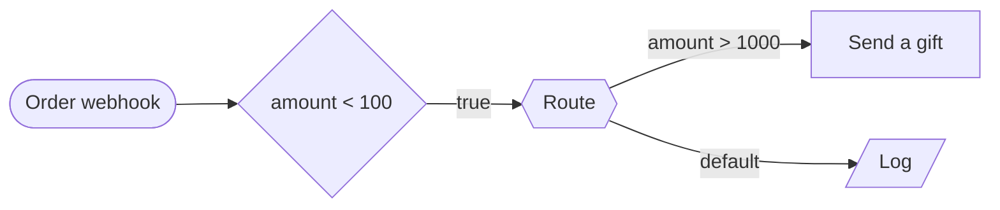

# Path feasibility

Which branches an input can actually take — and, for each one it can, the
payload that takes it.

```console
$ flowforge paths 6f0c…
Route (switch)
  ✓ refund  — drivable
      trigger: {"kind":"refund"}
  ✗ narrow
      contradicts Route → wide
  ✓ default  — drivable
      trigger: {"kind":"v0"}

2/3 branches reachable · 2 drivable from a trigger payload

1 branch no input can take.
```

---

## The gap this closes

Every static check FlowForge has reasons about the **graph**.

| Check | Question |
|---|---|
| [The linter](./ARCHITECTURE.md#static-analysis-the-linter) | is this node's config complete? |
| [Types](./TYPES.md) | what shape is the value flowing in here? |
| [Lineage](./LINEAGE.md) | where did this value come from, and where does it leave? |
| [Guarantees](./GUARANTEES.md) | which paths does this graph admit? |

All four are silent about this:



The gift case is wired. It type-checks. The graph reaches it. Dominance agrees
it is on a path. No policy is violated, no lineage finding fires — and no run
has ever taken it, because an order under 100 is not over 1000.

The reason nothing sees it is that all four questions are about the graph and
this one is about the **data**:

> is the conjunction of the branch conditions along a path satisfiable, and if
> so, by what?

That is a solver question, so FlowForge has a solver.

---

## What it produces

Two things, and the second is the one that changes how the product is used.

### Dead branches, with the condition they contradict

A branch no input reaches is a **lint error**, in the same class as a dangling
edge: either the branch or the condition above it is wrong, and one of them has
to change.

The finding carries a **minimal unsatisfiable subset** — the smallest set of
decisions that actually conflict, found by deleting guards one at a time and
re-solving. "No input can take `narrow`" is a true statement somebody has to
investigate; "it contradicts `Route → wide`" is the bug, written out.

### A witness per live branch, which is a test scenario

The solver returns a **model**, not a yes. Turned back into a trigger payload,
that model is an input which provably drives the branch — so a workflow's test
suite can be generated rather than written:

```console
POST /api/workflows/:id/tests/generate
{ "created": 3, "updated": 0, "uncovered": [], "coverage": { … } }
```

Each generated scenario asserts the branch it was written for:

```
name        Route → refund
input       { "kind": "refund" }
assertion   steps["route"].result == "refund"
```

That assertion is the point. A generated test that merely ran the workflow
would prove nothing; this one fails the moment an edit re-routes the branch it
was written to cover.

Generation is **idempotent** — a scenario records the branch it covers, so
running it again after a graph edit updates the payload rather than doubling
the suite — and it never touches a scenario a person wrote.

---

## The fragment, and why it stops where it does

Deciding arbitrary constraints is undecidable, so the only honest design is to
pick a fragment that has a decision procedure and say exactly where it ends
(`services/constraints.js`).

**Difference logic** over the numbers — `x ≤ c`, `x > c`, `x - y ≤ c`.
Satisfiability is negative-cycle detection in a constraint graph, which is
Bellman-Ford, and the shortest-path distances *are* a model. One classical
algorithm answers both halves of what the caller needs. Strictness is carried
exactly, as a `(constant, ε)` pair compared lexicographically, rather than
approximated with a small number.

**Finite domains** over everything else — `x == "open"`, `x in ["a","b"]`,
`x != null` — intersected and subtracted. Values compare the way FXL's
`looseEquals` does, so `true == "true"` here because it does at run time.

**Free propositions** for anything outside both. They constrain nothing on
their own, but two *opposite* uses of the same one cannot both hold, which is
exactly what keeps a validate node's `valid` and `invalid` outcomes mutually
exclusive without the solver knowing what a JSON Schema is. The same mechanism
covers an approval, a callback, a `contains` comparison, and a node's caught
failure branch.

The search is DPLL(T)-shaped rather than a CNF conversion: negation normal
form, then depth-first over the disjunctions, asking the theory after every
literal. Checking eagerly is what keeps the `default` outcome of a sixteen-case
switch — the conjunction of sixteen negations — from enumerating 2¹⁶ cubes.

---

## Precision, and which way it errs

Every approximation is on the **satisfiable** side, and that direction is the
entire safety argument:

- a spurious *satisfiable* costs a missing finding;
- a spurious *unsatisfiable* reports a live branch as dead and sends somebody
  to "fix" a correct workflow.

So `unknown` is the answer to everything the analysis cannot settle: a
comparison outside the fragment, a variable used as two sorts, an exhausted
search budget. A truncated report never claims a branch is dead — an unexplored
path is not a non-existent one — and an undecided branch marks its whole
subgraph `unknown` rather than leaving it unvisited and reading as unreachable.

### Variable identity is the whole correctness argument

Two reads of `amount` at different nodes are the same value only if nothing
between them rewrote it, and getting that wrong in one direction is harmless
while the other is not. **Merging two variables that are actually different can
manufacture a contradiction; splitting one that is actually the same can only
lose a finding.** So the rule is to split unless the graph proves otherwise.

The two reference styles resolve differently, because [the
engine](./ARCHITECTURE.md#the-execution-engine) resolves them differently:

- **`{{node.field}}` reads the whole run context**, so it works from anywhere
  downstream and names its producer exactly.
- **A bare identifier in an expression reads the *merge*** — `Object.assign`
  over the node's *immediate predecessors*. A condition emits `{ result }`, so
  `amount` is genuinely not in scope below one, however far upstream it was
  produced. It resolves through the [inferred output types](./TYPES.md):
  exactly one predecessor that could have produced the field, or a variable of
  its own.
- **Every trigger emits the run's single payload**, so all trigger reads share
  one `trigger.*` namespace. That is the only place two reads are merged, and
  it is merged because the engine guarantees they are the same value.

A field two nodes could have written is therefore left uncorrelated:

```
hook → [amount > 1000] → transform{ amount: 5 } → [amount < 100]
```

reports nothing, because the second `amount` is the transform's.

---

## Coverage, and the branches nothing can cover

`coverage` reports three numbers and the gap between the last two is a feature,
not a shortfall:

| | |
|---|---|
| `branches` | wired outcomes across every decision |
| `reachable` | outcomes some input takes |
| `generatable` | outcomes a **trigger payload** takes, in dry-run mode |

Scenarios run in dry-run mode, where approvals auto-approve and callbacks
report `received` ([the test
scenarios](./ARCHITECTURE.md#workflow-test-scenarios)). So an approval's
rejected side is a real branch that no generated test can drive — and a schema
gate's `invalid` side is decided by data the fragment does not model.

Each such branch reports **why** rather than being silently absent:

```
✓ false  — reachable, but not from a payload
      test mode always takes the other side of Approve
```

A witness also separates its payload from its **assumptions** — a value it
could not set, like an upstream HTTP response's `status`. A scenario resting on
one of those would fail for a reason nobody wrote down, so it is withheld and
the dependency is named.

---

## Where it runs

| Surface | |
|---|---|
| 🧭 Paths panel | analyses the canvas on screen, and writes the generated suite in one click |
| Issues panel / `flowforge lint` | dead branches only, as errors |
| `flowforge paths <id>` | exits non-zero on a dead branch; `--cover` also on an untested live one |
| `GET /api/v1/workflows/:id/paths` | the CI shape: `ok`, per-branch verdicts, `coverage` |
| `POST /api/workflows/:id/tests/generate` | writes the scenarios into the suite |

Deliberately **not** enforced at deploy, unlike [policies](./POLICIES.md) and
[guarantees](./GUARANTEES.md). A dead branch is a defect, but it is a defect
that has never once affected a run — by definition, nothing takes it — so
refusing a deploy over one would block a fix for an unrelated outage in order
to complain about code that cannot execute. It is a lint error, which is
exactly its weight.

---

## Limits, stated plainly

- **Arithmetic between variables** is not modelled beyond differences.
  `amount * rate > 100` becomes one opaque variable, so it contradicts
  `amount * rate < 10` and correlates with nothing else.
- **String structure** is invisible. `contains`, `startsWith`, and regex-shaped
  comparisons are free propositions.
- **A validate node's schema is not read.** Its two outcomes exclude each
  other and constrain nothing else.
- **A branch reported reachable is reachable by the constraints**, which is not
  the same as "the workflow can reach it in production" — an upstream HTTP node
  may never in fact return 500. That is why witnesses separate assumptions from
  payload, and why generation refuses the ones that rest on an assumption.
- **The search is bounded** (`MAX_PATH_STATES`, `MAX_SOLVER_CALLS`). Hitting
  either marks the report truncated and suppresses every dead-branch finding.

Each of these makes the analysis quieter, never wronger.
